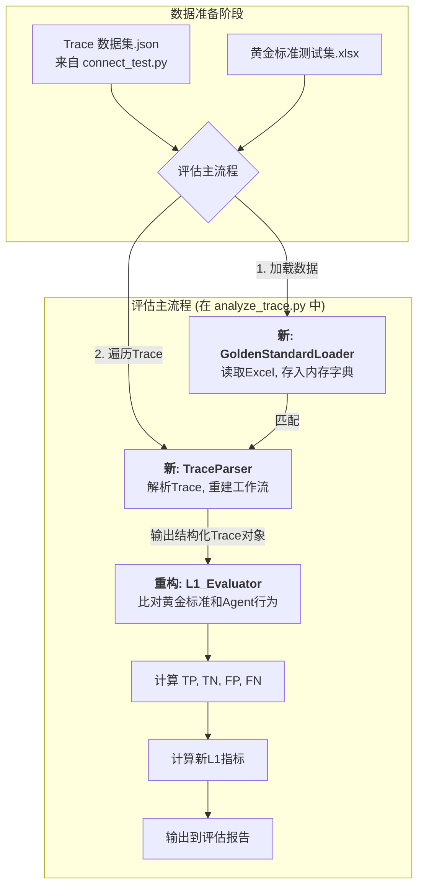

标注过的语料实体提取效果还行


暂时还没标注的实体完全无法泛化识别


实体识别的结果还行，但是意图这部分有问题（大多识别成了unknown，似乎欠拟合？）暂时还不清楚原因，另外relation这块似乎过拟合了（几乎所有实体两两之间都强制识别了关系）


调整了分类器权重weight_grammar = 1  # 从0.1增加到1，weight_relation = 0.5  # 从1.0减少到0.5。但是依旧是grammar识别不准，relation识别太多过拟合，目前只能从模型结构的训练和数据清洗去调整优化了


尝试除了正向关系的标签还给relation增加了none标签，明确告诉Roberta模型"什么是没有关系的实体对"，提供了正负样本的按比例分配的学习方法，缓解"所有实体对都有正向关系"的错误学习模式

但是初步实验的分阶段训练并没有对grammar的预测准确性起多大效果，依旧准确率不高


实体span还是过拟合了，在新构造的测试问题上span没有泛化性


尝试在不改变Roberta的多分类器输出层的情况下，调整分类器训练权重，只保留grammar的训练梯度，使用的concat的700+的标注和学习率等配置。但是效果不理想，其他三个类无法识别是在意料之中，但是grammar训练了依旧无法识别就说明**多分类器对这个难度的问题不适用**！！！


解决了grammar多分类的编码异常的问题，虽然loss变化上有一点点过拟合，但是在我们构造的小领域测试数据上泛化目前是没有什么问题的。但是把修复的grammar分类器再加回原始的多分类器Roberta上又影响了其他分类的效果了，还需要进一步修改训练参数与结构进行调试


通过调整学习率和训练的分类器权重可以优化构建的测试集效果，目前小范围测试发现grammar、entity、relation的效果还行，其中relation与grammar有一点点过拟合。另外subdomains的训练会问题比较大，因为数据集比例极度失衡，目前标注的数据基本都是delivery的


多任务分类目前grammar和entity问题不大，主要是subdomains和relation预测不准，他们的数据都比较差、另外relation分类预测任务相较另外几个任务难一点


现在数据质量对预测的影响比重比较大，目前构造的测试数据中发现的可能与数据质量相关引起的问题有：问题冗余时会有重复的实体提取、标注数据样本量少/前后标注不一致导致实体边界提取重叠


通过随机搜索算法实验找到一组模型训练的局部最优的超参数组合（训练配置）


目前在多任务RoBERTa模型的训练过程中遇到的真正的系统性问题，训练损失极低，但某些任务的验证F1分数却很差。训练日志分析请求**： ``` 警告：损失低得可疑，可能存在数值问题 损失组成部分：语法=3.16e-08，子领域=0.0，位置=5.05e-07，实体=2.53e-07，关系=1.49e-07  验证指标：{'eval_loss': 1.004, 'eval_grammar_f1': 0.973, 'eval_subdomain_acc': 1.0, 'eval_start_end_f1': 0.952, 'eval_span_f1': 0.004, 'eval_relation_f1': 0.0} `**

**需要调查的具体问题**： 

- **损失计算问题**：各个任务的损失低得可疑（接近零），这表明可能存在**数值不稳定或损失计算不合理问题**
- **特定任务的性能不佳**：    - `eval_span_f1`：0.004（极其糟糕）    - `eval_relation_f1`：0.0（完全失败） 
- **训练与验证的差异**：训练损失极低，但验证性能不佳，这表明可能存在**过拟合或评估指标问题**。 
  - **需要进行的分析**： 检查每个任务（语法、子领域、位置、实体、关系）的损失计算方法，以找出数学错误或数值不稳定的情况。 
  - 回顾跨度检测和关系分类任务的F1分数计算逻辑。 检查**数据不平衡**、标签编码问题或指标计算错误。

**现状：**

- grammar、subdomains分类任务基本能够很好的进行测试预测了（因为解决了grammar、subdomains分类任务的训练错误问题）
- **entity与relation经过实验调试在训练流程上是没有明显问题的（已反复检验了训练metric和label方法正确性）；**
  **但是entity与relation任务的难度高，训练loss与验证F1计算方法可能需要实验进行因地制宜的调整；**
  **特别是避免数据不平衡进一步提高了训练难度**


新加了多任务分类器的权重超参数优化组合2（训练配置+任务权重）的搜索结果


更新优化后的超参数组合（训练配置+任务权重）又把测试预测的效果提高了一点（如上图）之前的优化组合1中badcase的短句样本容易识别掉部分实体，但新优化组合2现在可以识别的到


针对badcase的问题是可以通过不断补充垂域相关的泛化数据进行有效改善的


冻结参数进行分离训练的效果目前实验看效果不好（暂时未检验代码）


新的基于evalLoss目标的随机搜索的超参数组合，eval的loss变化很好，但是测试很一般


---

### 关键发现和修改要点

#### Grammar和Subdomain任务的依赖性分析

- **低权重设置**：表明这两个任务对整体性能贡献较小
- **简单分类**：都基于CLS token，计算复杂度低
- **独立性强**：与Entity/Relation任务没有强耦合

#### Entity和Relation任务的核心地位

- **高权重设置**：表明这两个任务是模型的核心
- **复杂架构**：Entity需要边界检测+类型分类，Relation需要实体对交互
- **相互依赖**：Relation任务依赖于Entity任务的输出

#### 移除Grammar和Subdomain的影响评估

1. **简化模型架构**：减少分类器数量，降低参数量
2. **专注核心任务**：更多计算资源投入到Entity和Relation
3. **减少标签噪声**：避免简单任务对复杂任务的干扰
4. **提升训练效率**：减少损失计算和反向传播复杂度

---


实现跑通了单独针对entity/relation的训练网络结构，相较于之前冻结四任务部分输出神经元权重的效果模糊的实验，单独抽离出两任务的Roberta模型是确定的可以提升模型在抽取entity上的稳定性，减少entity_positions之间交叉的错误问题出现，改进效果见上述两图对比


'eval_start_end_f1': 0.93比较高，说明单独训练的神经网络结构对entity的位置抽取比较准

`start_end_f1`表现良好（0.92）是因为：

1. **简单的二分类任务**：只需要预测token是否为实体的开始/结束位置
2. **直接的标签格式**：使用简单的0/1标签，没有复杂的索引转换
3. **正确的评估逻辑**：直接比较二进制预测结果


导致`span_f1`和`relation_f1`分数极低的根本原因：

- **标签格式不匹配问题**。在`compute_metrics`函数中当`span_labels`是列表格式时，代码创建了全零的虚拟标签（`torch.zeros_like(pred_span_ids)`），这意味着所有真实标签都被设置为0，而模型的预测值通常不是0，导致F1分数极低。
- **数据预处理与评估不一致**。在预处理阶段`span_entity_labels`被保存为列表格式，但在`compute_metrics`中，代码期望的是张量格式来提取第三列（标签ID）
- **标签ID映射问题**。在`load_labels_fromfile`函数中标签ID从1开始，但在前向传播中，又转换为0-based索引，这种来回转换容易造成混乱。

图1、图2、图3分别为修复后的评估指标训练验证的效果，均恢复正常范围，这也为后续随机搜索方法提供了良好的优化目标基础


修复后使用随机搜索的最佳超参数组合


排查解决了导致`span_f1`和`relation_f1`分数极低的根本原因，数据预处理与评估不一致。在预处理阶段`span_entity_labels`被保存为列表格式，但在`compute_metrics`中，代码期望的是张量格式来提取第三列（标签ID），导致，代码始终创建了全零的虚拟标签。目前已经将预处理的列表与metric的张量统一分开处理。


结合两个双任务模型的意图识别的API接口更加精准且稳健，并且使用预测的时间依旧在20ms内


构建prompt+chosen/rejected样本，来强化训练模型对样本的预测偏好


生成的偏好对数据集构成案例


目前已初步完成基于已有数据集来生成偏好对的SOP——可以作为后续DPO训练的基础 + GRPO奖励模型训练的部分材料

下一步需要进行基线模型（双任务Roberta）评估，同时也是我们目前SFT工作的**评价与迭代**的关键步骤


现状

已解决问题：

已有双任务意图识别模型（Roberta 和 API）+ DPO的偏好数据（JSON 和 生成的SOP）

后续构想：

​	**五个步骤**:

1. **生成偏好数据集**: 使用基线模型对原始数据集进行推理并生成偏好对——**已完成**
2. **评估基线模型**: 在测试集上评估原始基线模型性能——**待评估**
3. **DPO强化学习训练**: 使用LoRA技术进行DPO微调——待实验
4. **评估训练后模型**: 在相同测试集上评估DPO微调后模型性能
5. **对比分析**: 对比实体F1、关系F1等关键指标的提升情况

当前面临问题：

任务评估的策略待调研**（自己明确目标评估侧重点与边界 + 通过GPT探究具体实施方法）**；评估的范围与数据待整理**（暂时不需扩展数据和范围）**


### 模型表现分析——当前实体与关系的F1值计算有点苛刻了！（无法容忍小样本的标注存在波动情况）

1. **Subdomain 分类**：表现完美（100% 准确率）
2. **Grammar 分类**：表现良好（84.85% F1）
3. **实体识别**：表现中等（68.93% F1）——有必要区分span与type两个的评估指标，因为这两个在标注的时候很容易出现标注不统一的情况，特别是type的label区分不清晰很容易出现前后歧义的标注
4. **关系抽取**：表现较差（24.37% F1）——relation的标注就更多歧义了，而且还算上entity的累加错误

### 主要问题

1. **关系类型混淆**：模型经常将 `prj:has_role` 预测为 `prj:has_prop`，也有些是标注时候前后label有差异的问题
2. **复杂句子处理**：包含多个实体的句子关系抽取准确率低
3. **语法分类错误**：部分 `reason` 和 `judge` 类型被误分类

### 改进建议

1. **关系抽取**：需要更多 `prj:has_role` 类型的训练数据
2. **复杂句子**：增加多实体、多关系的训练样本
3. **语法分类**：加强 `reason` 和 `judge` 类型的特征学习

针对类似 "value": "柜子"这种可能存在标注时候（box/panel）出现前后歧义的label问题——是否需要近似语义匹配？或者简化成单一表示panel？


原始模型对于新标签框架的泛化能力也还行，这部分再增加相应的数据训练后应该会更准


- **评估的f1——评估优化——**数据用之前手动test的数据，后面也加入了一点，共33个标注样本；f1值计算使用的是一整句实体的字符级匹配才算TP，评估发现 entity F1 ≈0.7，grammar/subdomains F1≈1；这部分entity受标注数据质量的影响比较大。——待优化数据和标注
- **api推广应用——推进重点——**重构了的entity框架，现18个一级分类，之前6个，新框架就很好的融入的略哥那边的表结构实体数据，SFT新训练的模型也能回答部分表结构中实体构造的问题。——待添加新实体语料和标注
- **dpo训练的——技术实验——**这部分实现遇到难点，如果使用transformer的TRL库的DPO框架是因果模型的文本logit格式，我们这个多任务输出就需要改造输出的模型头


v3版本146个实体（包含Unknown）

v2版本186个实体标签（包含Unknown）

v1版本57个旧实体标签


**API推广应用**——A组——成功把新版Roberta的API嵌入到略哥那边的工作流中了，目前可同时返回Roberta和LLM的意图识别结果，方便后续数据和模型迭代


**API推广应用**——R组——调研后发现R组是先对用户问题进行三分类（**chat闲聊、download文档查看、query信息咨询**），再考虑回答，且会拼接约多条历史记录辅助识别意图。——**先仅尝试支持对query的训练**

- download：帮我找一下蓝云凭他v4.9发布记录、帮我找一下cetjava代码规范
- query：7320-G支持哪些通信协议
- chat：strawarry里面含有几个r

R组的槽位比较复杂不固定。它的领域范围非常大，且用户输入模糊，难以精准提取。R组通过决策树设定节点，引导用户补充问题信息（非问题重写），**大模型根据信息做决策**，虽槽位识别非精准提取信息，但决策准确度较高。

RAG 检索痛点问题：

- **检索误差**：RAG 本身是概率性检索，相近型号和版本号易导致检索太多，无法控制token，如 5100 和 5100G、不同版本号等情况。
- **权重识别需求**：检索时需识别关键词权重，避免因分词权重相同导致相似度误判，但实现难度较大。


评估结果可以清晰地指出各自的瓶颈，为下一步的优化（如优化RAG的Embedding模型、优化SQL生成的Prompt工程）提供明确方向。


添加功能实现了非极大值抑制(NMS)机制，用于解决基于位置索引预测时候出现的实体边界重叠的问题，通过IOU检测以及子串包含检测来优化实体重叠消除逻辑（现在对于例子"华为项目的设备是否都已经发货了？"：实体A："华为项目的设备"（位置0-6）；与实体B："设备"（位置5-6）不会再重复出现）


### **当前 L1 实现的潜在漏洞讨论**

基于以上分析，我们可以清晰地看到当前实现方式与“评估守门员能力”这一目标之间的差距。漏洞主要有以下几点：

1. **评估对象错误：评估的是“输入内容”，而非“守门员的反应”**

   - **现状**：当前的逻辑是，拿到一个用户输入后，脚本自己用一套规则 (`_classify_user_input`) 去判断这个输入“应该”属于哪一类。然后就结束了，直接拿这个分类结果去统计。
   - **漏洞**：整个过程**完全没有去看 Agent 对这个输入到底做了什么反应**。我们只是在对输入文本本身进行分类，这更像是在做“数据分析”，而不是在“评估 Agent 的行为”。一个真正的“守门员”评估，必须包含两步：A. 识别输入（例如，这是一个领域外问题）；B. **检查 Agent 的输出（例如，Agent 是否真的拒绝回答了）**。当前实现完全缺失了步骤 B。

2. **数据源混淆：将对话过程中的所有 `span` 输入都视为“初始输入”**

   - **现状**：[`extract_user_queries()`](vscode-webview://1l0bua3v5ikm7ovf6qgn5ml9595vu0n4989vrfmvvdn84ajmbcnu/MQL_Agent_Eval/analyze_trace.py:47) 会遍历一个 `trace` 里的**所有 `span`** 去找用户输入。
   - **漏洞**：一个 `trace` 包含了一整轮对话。除了用户的第一句问题，还可能包含 Agent 追问后用户的补充回答，或者系统内部模块之间传递的中间结果。将这些中间产物都当作是需要“守门员”来判断的“初始输入”，在逻辑上是不准确的。L1 “守门员”应该只作用于**对话的最开端**，即用户的第一句输入。

3. **指标定义模糊且可能产生误导**

   - **现状**：例如，`acceptance_rate` 的定义是 `in_domain` 数量 / 总问题数。

   - 漏洞

     ：这个指标并不能反映“守门员”的真实表现。举个例子：假设我们有100个领域内问题，Agent 正确处理了90个，但粗暴拒绝了10个。同时，我们有50个领域外问题，Agent 本该全部拒绝，但它错误地接受并处理了20个。

     - 按现有逻辑，它可能会统计出 `in_domain` 的问题有100个，然后计算出一个看似很高的“接受率”。
     - 但实际上，这个“守门员”的表现很差：它错误地拒绝了10%的有效用户，又错误地放过了40%的无效请求。当前的指标完全无法反映出这种细微但关键的失败。

4. **分类规则过于脆弱**

   - **现状**：[`_classify_user_input()`](vscode-webview://1l0bua3v5ikm7ovf6qgn5ml9595vu0n4989vrfmvvdn84ajmbcnu/MQL_Agent_Eval/analyze_trace.py:206) 完全依赖于硬编码的关键词和正则表达式。
   - **漏洞**：这种方法非常脆弱。比如，一个领域外问题“帮我查查附近有什么好吃的”，因为它不包含任何业务关键词，会被正确分类为 `out_domain`。但如果用户说“帮我查查这个项目的负责人和附近有什么好吃的”，因为它包含了“项目”和“负责人”，就可能会被错误地分类为 `in_domain`。

我的初步想法是，我们需要将评估的核心从**“分析输入”**转向**“分析输入与输出的匹配关系”**。为了做到这一点，我们需要：

1. **精准定位**：在每个 `trace` 中，准确地找到代表“用户初始输入”的 `span` 和代表“Agent 最终（或首次）回复”的 `span`。
2. **黄金标准**：我们需要一套带有“黄金分类”的测试集，用来判断用户的初始输入应该被接受还是拒绝。
3. **行为判断**：我们需要定义一套规则，用来判断 Agent 的回复是属于“接受处理”还是“拒绝服务”。
4. **指标重构**：基于以上三点，重新计算真正能反映“守门员”能力的指标，如“领域内问题正确接受率”和“领域外问题正确拒绝率”。


1、精准定位：其他业务开发同事在设计这个外部Agent的时候其实是内部添加了很多的subAgent（如# Role: 语义有效性校验专家 # Role: 问题分组专家 等等subAgent），你可以通过一个trace中所有输入与输出来整理这个Agent的工作流具体什么样的，以及区分哪些是用户的输入哪些是subAgent的中间过程输出，这样我们就挑选并找到输入与对应需要匹配的输出进行评估（比如针对L1层评估，语义有效性校验专家、代词识别指代消解专家subAgent的输出应该是我们需要评估的重点，其他层的评估也应该匹配对应的若干个subAgent的输出）
2、黄金标准：目前我已经构建了一套带有“黄金分类”标签的测试集问题语料，但是我们需要考虑一下如何把构建的黄金标签加入到当前的L1评估体系中（因为当前提取的数据只有输入的问题和Agent的输出，还没有携带语料类型的黄金标签）。
3、行为判断：当前Agent框架针对语义有效性校验专家、代词识别指代消解专家subAgent的提示词约定的输出中是包含了结果是否成功的字段，可以提取使用。


好的，信息非常清晰。我们现在拥有了重构 L1 评估所需的所有拼图：

1.  **Trace 数据样本**: [`MQL_Agent_Eval/eval_data/mql_agent_evaluation_dataset_20250901_175016.json`](MQL_Agent_Eval/eval_data/mql_agent_evaluation_dataset_20250901_175016.json)
2.  **黄金标准说明**: 您将提供一个包含“问题语料”、“gold_category”和“问题类别”的 Excel 文件。
3.  **行为判断依据**: sub-Agent 的输出中包含可直接解析的成功/失败字段。

基于这些，我现在为您更新设计框架，并规划出具体的代码修改步骤。

---

### **L1 评估重构设计方案**

#### **1. 总体架构**

我们将引入两个新的核心组件，并重构现有的评估流程。



#### **2. 关键组件设计**

**组件一：`GoldenStandardLoader` (黄金标准加载器)**

* **职责**: 读取您提供的 Excel 文件，并将其转换为一个高效查询的数据结构。

* **输入**: Excel 文件路径。

* **输出**: 一个字典，`key` 为“问题语料”，`value` 为一个包含 `gold_category` 和 `问题类别` 的对象。

  ```python
  # 伪代码
  {
      "查询项目P-123的负责人是谁？": {
          "gold_category": "typical_problems",
          "question_type": "项目基本信息"
      },
      "查一下那个超期的项目。": {
          "gold_category": "ambiguous_problems",
          "question_type": "综合查询"
      }
  }
  ```

* **实现位置**: 在 [`MQL_Agent_Eval/analyze_trace.py`](MQL_Agent_Eval/analyze_trace.py) 中新增一个类或一组函数。需要安装 `pandas` 和 `openpyxl` 来读取 Excel。

**组件二：`TraceParser` (Trace 解析器)**

* **职责**: 将原始的、扁平化的 `spans` 列表，转换为一个结构化的、能够反映 Agent 内部工作流的对象。

* **输入**: 一个 `trace` 中的 `spans` 列表。

* **输出**: 一个 `ParsedTrace` 对象（可以用 `dataclass` 或字典实现）。

  ```python
  # 伪代码
  class ParsedTrace:
      trace_id: str
      initial_user_input: str
      sub_agent_calls: List[Dict]
      final_response: str
      golden_standard: Dict  # 从GoldenStandardLoader匹配到的黄金标签
  ```

* **核心逻辑 (识别 sub-Agent)**: 我将分析 [`mql_agent_evaluation_dataset_20250901_175016.json`](MQL_Agent_Eval/eval_data/mql_agent_evaluation_dataset_20250901_175016.json) 中的 `span` 结构。我推测可以通过 `span` 的 `name` 字段（例如 `name: "# Role: 语义有效性校验专家"`）来识别不同的 sub-Agent。`input` 和 `output` 字段则记录了它们的输入输出。

* **实现位置**: 在 [`MQL_Agent_Eval/analyze_trace.py`](MQL_Agent_Eval/analyze_trace.py) 中新增一个核心类。

**组件三：`L1_Evaluator` (L1 评估器 - 重构)**

*   **职责**: 实现新的 L1 评估逻辑，**评估行为而非内容**。
*   **输入**: 一个 `ParsedTrace` 对象列表（已经过解析和黄金标准匹配）。
*   **核心逻辑**:
    1.  遍历 `ParsedTrace` 对象。
    2.  检查 `golden_standard` 是否存在。如果不存在，则跳过该 `trace`（因为它不在我们的黄金测试集中）。
    3.  根据 `golden_standard['gold_category']` 判断预期行为（`Expected: Accept` 或 `Expected: Reject`）。例如，`typical_problems` 应该被接受，而 `invalid_problems` 和 `ambiguous_problems` 在 L1 层面应该被“拒绝”或“要求澄清”。
    4.  在 `sub_agent_calls` 中查找 L1 相关的 sub-Agent（如“语义有效性校验专家”）。
    5.  解析该 sub-Agent 的 `output` JSON，根据 `valid` 字段判断实际行为 (`Actual: Accepted` 或 `Actual: Rejected`)。
    6.  根据预期和实际行为，将结果归类到 TP, TN, FP, FN。
*   **实现位置**: 重构 [`MQL_Agent_Eval/analyze_trace.py`](MQL_Agent_Eval/analyze_trace.py) 中的 `evaluate_L1_input_layer` 方法。

#### **3. 代码修改计划**

现在，我将这个设计方案转化为具体的编码步骤。

**第一步：分析 `trace` 数据结构并实现 `TraceParser`**

这是所有工作的基础。我现在就来读取并分析您提供的 `trace` 数据样本，以确定识别 sub-Agent 的可靠方法。


| 问题语料                                                     | gold_category      | 问题类别   |
| ------------------------------------------------------------ | ------------------ | ---------- |
| 给我所有项目经理是王明，项目类型是PQ项目，客户是XX银行，发货状态是已到货，并且4S部门意见是风险高的项目。 | typical_problems   | 综合查询   |
| 列出所有发货到北京市海淀区XX大厦，收货人是张三，物料包含服务器和交换机，并且发货日期在本周内的所有发货箱号和物流信息。 | typical_problems   | 发货与物料 |
| 查找所有合同状态是执行中，业务类型是T1，风险等级是中风险，项目经理是一级项目经理，并且最终用户是YY集团的合同清单。 | typical_problems   | 合同信息   |
| 统计一下所有由交付团队负责，项目状态是进行中，客户分类是VIP客户，销售区域在华东区，并且最近一次变更金额大于10万的项目数量。 | typical_problems   | 统计与状态 |
| 查一下那个项目的进度。                                       | ambiguous_problems | 综合查询   |
| 那个项目的负责人是谁？                                       | ambiguous_problems | 人员与组织 |
| 李经理名下有多少个项目？                                     | ambiguous_problems | 综合查询   |


---

**时间匹配完全可行**：发现trace数据与API请求时间完美对应（注意UTC时差）

### 💡 **在线评估管线最终实施方案**

基于验证结果，我推荐以下实施策略：

#### **阶段1：触发执行**

- 批量发送API请求
- 记录精确时间戳和问题内容
- 获取API响应结果

#### **阶段2：等待同步**

- 等待2-3分钟让trace数据写入数据库
- 监控数据库最新记录时间

#### **阶段3：数据关联**

- 使用时间窗口（±3分钟）+ UTC转换查找trace
- 通过问题内容匹配验证关联
- 确保API响应与trace输出一致

#### **阶段4：评估分析**

- 收集完整的trace span数据
- 应用现有L1评估逻辑
- 生成评估报告


**实际laminar表结构：**

- span_id, name, span_type, start_time, end_time
- input_cost, output_cost, total_cost, model, session_id
- project_id, trace_id, provider, input_tokens, output_tokens, total_tokens
- user_id, path, input, output, input_lower, output_lower
- size_bytes, status

```sql
SELECT 
    trace_id,           -- 🔑 核心追踪ID
    session_id,         -- 会话标识  
    project_id,         -- 项目ID (I-23112109)
    start_time,         -- 开始时间 (UTC)
    end_time,           -- 结束时间
    path,               -- 操作路径 ('chat', 'chat.openai.chat')
    input,              -- 🎯 用户输入 (L1-L3关键)
    output,             -- 🎯 Agent输出 (L3-L4关键)
    name,               -- 操作名称
    model,              -- 使用模型
    input_tokens,       -- Token统计
    output_tokens,
    total_tokens,
    status              -- 执行状态
FROM spans
```


----


### L1层评估的现状

**数据：**用GPT按比例15:4:3:3（典型/歧义/无关/恶意问题）批量生成，实现了用AI表格批量分类标注然后人工抽检

**在线预测匹配：**A组原始接口只有最终结果；目前实现clickhouse的成功解析，匹配对应trace_id的subAgent评估对象，也就是目前有了y_true，也能批量预测并获取到y_pred

**批量评估：**目前评估指标的计算还比较简单就是混淆矩阵和f1，整个计算管线跑通了，但是计算设计的代码还有点bug（subAgent的计算优先级存在混淆）

### 后续的难点

数据：L2的黄金标准 的构造 和 自动标注 比较麻烦，A组这部分与之前的Roberta应该是两套不同体系的

流程：A组是LLM问题分解后 - 先cypher查询 - 再Cypher意图与槽位提取，这里似乎有两次意图的提取，而且不确定这个流程是不是固定下来的

### 接下来计划

优化L1评估管线的代码，解决评估计算的设计bug

分析A组的意图与槽位的评估数据该有的设计方法，并进行AI表格自动标注


工具选择成功率 - 检查complete的结果——判断是否能根据已知的Schema为这个问题生成一个合法的Cypher查询

cypher查询组件完整性判断 - 实体关键词、数据库语法检查

cypher查询结果的黄金标准获取比较困难

cypher查询语句的操作符生成的规律不好约束，不太好作为固定评估指标

{"question":"统计一下当前项目的相关人员总数","project_id":"I-23112109"}

{
  "complete": true,
  "cypher": "MATCH (p:project { _id: 'I-23112109' }) RETURN size(p.members) AS person_count",
  "error": ""
}


之前版本的_extract_with_optimized传入只是裸的 Cypher（或普通文本），不含 `complete` 字段。即：不是解析逻辑失效，而是“裁剪过度”导致 `complete` 字段在早期筛选阶段丢失。

本次补丁做了两层修改：1、优先锁定 `input` 含 “图数据库Cypher查询生成专家” 的 span；2、在 [_extract_with_optimized](vscode-file://vscode-app/e:/vscode/Microsoft VS Code/Microsoft VS Code/resources/app/out/vs/code/electron-browser/workbench/workbench.html) 中，当命中候选时不再返回提炼后的查询文本，而是构造{"complete": <bool>, "cypher": "<query>"}


{"question":"查一下最近的合同。","project_id":"I-23112109"}

查询contract表中pms_project_code为'I-23112109'的合同记录，按last_modified_time降序排列，返回第一条记录


## 黄金标准与标注口径

- y_true_complete 的标注准则
  - 风险：你给出“典型/实体密集型=true，歧义/领域外/无效=false”的口径，但现实中“典型但缺关键实体”的样本是否应标 false？歧义问题若 Agent 触发澄清并补齐信息，之后 complete 是否 true？
  - 建议：将“场景标签”与“complete 标注”解耦，给出判定规则（是否在该 span 阶段已具备生成查询的必要条件）。


## 校验器与评估指标

- 组件验证的脆弱性
  - 风险：纯正则/包含式匹配对重排序、别名、参数化、子查询/管道语法不鲁棒。
  - 建议：优先做“轻量解析+规范化”（Cypher/MQL AST 或半结构化分段），最少也应：去注释→统一大小写→去多余空白→别名映射→顺序无关匹配。


#### **1. 维度二，指标2：Cypher语法检查是如何实现的？（详细解析）**


您对这一点的疑问很正常，这确实是一个技术细节。其实施起来比听上去要简单，主要有两种自动化方法：

**方法一 (最推荐)：利用数据库驱动的“预执行”功能**

这是最可靠的方法，因为它利用了数据库自身的语法解析器。几乎所有的数据库驱动（包括Neo4j的官方驱动）都支持发送一个查询去**解析和生成执行计划，但不真正执行它**。

- **原理**：我们尝试让数据库为我们的Cypher“制定一个计划”。如果Cypher有语法错误，数据库在制定计划的阶段就会直接抛出`SyntaxError`异常。如果它成功返回了一个计划（或者没有报错），就证明语法是合法的。
- **优点**：与真实的数据库环境100%匹配，最为精准。
- **实现细节 (以Python伪代码为例)**：

**方法二：使用本地语法检查库 (Linter)**

- **原理**：有一些第三方的开源库可以对Cypher代码进行本地的语法解析。
- **优点**：不依赖数据库连接，速度可能更快。
- **缺点**：可能与您线上数据库的版本不完全匹配，存在微小差异。

**结论**：**推荐使用方法一**。它既简单又可靠，能够完美地自动化“Cypher语法通过率”这个指标的计算。


---


### L3评估现状与难点

经过调研确认了以下**三个**较为合适建立的评估指标：

- **查询可生成性判断准确率**：这个还在进一步优化检索代码，这个指标比较明确，匹配对象就是图数据库Cypher查询生成专家是否能针对正常问题语料输出cypher
  - <u>这个subAgent输出有个complete字段可作为评估的钩子去匹配</u>
- **Cypher语法通过率**：这个初步打算使用数据库在线驱动的`EXPLAIN`功能进行自动化批量校验。或者使用离线的开源库进行类似的语法检验，实现也是比较明确的
  - <u>这个使用开源库进行语法校验</u>
- **Cypher关键组件验证通过率**：这个目前难点较大，一个是**“关键组件”的确定会有 不固定、不一致 问题**，另一个是代码实现复杂度会相对高，当前是让表格AI（表格的LLM可选）去模拟Agent来生成cypher的关键组件的标注（搭配相同prompt）
  - <u>这个目前观察下来，在subAgent（cypher智能体）与AI表格（模拟评估）都能生成cypher的情况下，两者的cypher结构一般都有出入，但是关键组件的重合能在**70%左右**，可作为交集部分判断的参考</u>

**数据标注与批量预测还是引用的L1那套管线：**用GPT按比例批量生成，实现用AI表格批量分类标注（查询cypher是否可生成、标注cypher关键组件）然后人工抽检


**当前查询大致流程：原始问题 —— L1层安全筛查 —— cypher生成判断（仅作为有效问题的一个筛选） —— cypher查询（没用上）—— 任务规划与推理Agent（规划问题）—— 智能工具选择器（对接mongoSDK生成查询配置）**

- **无效问题路径：**{"question":"中国的首都是哪里？","project_id":"I-23112109"}

  - 语义有效性校验专家（句子结构校验）

  - 代词识别、指代消解专家

  - 问题分组专家
    - 图数据库Cypher查询生成专家
      - （"error": "问题'中国的首都是哪里？'与图数据库中的实体、属性或关系无关联，无法生成合法Cypher查询"）

  - 问题生成器
    - 你输入的问题有误，请重新输入。你可以咨询以下问题：

      - 查询项目ID为I-23112109的项目信息
      - 获取项目ID为I-23112109的详细数据
      - 查找项目ID为I-23112109的相关记录


- **有效问题路径：**{"question":"统计一下所有由一级销售经理负责，在华北区，过去一个季度内签署的，客户分类是重要客户，并且合同金额超过300万的合同总数。","project_id":"I-23112109"}
  - ....
  - 图数据库Cypher查询生成专家
    - {
      "complete": true,
      "cypher": "MATCH (c:contract) WHERE c.sale_manager_1_level IS NOT NULL AND c.sale_team_1st = '华北区' AND c.signing_date >= date('now') - duration('P3M') AND c.customer_classification = '重要客户' AND toInteger(c.price_including_tax) > 3000000 RETURN count(c) AS total",
      "error": ""
      }
  - 任务规划与推理Agent
    - （{"thought":"需要统计满足多个条件的合同总数：一级销售经理负责、华北区、过去一个季度内签署、客户分类为重要客户、合同金额超过300万。首先需确认项目编号I-23112109对应的合同信息，再筛选符合上述条件的合同。","plan":"调用工具查询项目编号I-23112109下的所有合同信息，然后根据条件进行过滤统计。","action":{"type":"tool","content":"查询项目编号I-23112109对应的所有合同记录"},"thoughtNumber":1,"needMoreThoughts":true}）
  - 智能工具选择器
    - {"tool":"find","parameters":{"collection":"contract","filter":{"pms_project_code":"I-23112109"}}}
    - ...
    - {"thought":"已获取项目编号I-23112109下的所有合同记录，现需根据问题条件进行筛选：一级销售经理负责、销售区域为华北区、签署日期在过去一个季度内、客户分类为重要客户、合同含税金额超过300万元。当前仅有一条合同记录，需逐项验证其是否满足所有条件。","plan":"检查当前合同记录是否满足全部筛选条件，若满足则计数加1，否则不计入。","action":{"type":"tool","content":"检查合同编号23-IX-110002是否满足一级销售经理负责、销售区域为华北区、签署日期在2024-10-16至2025-01-16之间、客户分类为重要客户、合同含税金额大于3000000的条件"},"thoughtNumber":1,"needMoreThoughts":true}
    - `{"tool":"find","parameters":{"collection":"contract","filter":{"_id":"23-IX-110002","sale_manager_1_level":{"$exists":true},"sale_area":"华北区","signing_date":{"$gte":"2024-10-16","$lte":"2025-01-16"},"customer_classification":"重要客户","price_including_tax":{"$gt":"3000000"}}}}`
  - 任务规划与推理Agent
    - {"thought":"当前已获取该项目的唯一合同记录（合同编号23-IX-110002），但检查结果显示该合同不满足所有筛选条件，且无其他合同记录。因此，满足条件的合同总数为0。","plan":"整合所有查询结果，确认无其他合同记录，输出最终统计结果。","action":{"type":"output","content":"满足条件的合同总数为0。"},"thoughtNumber":3,"needMoreThoughts":false}
  - 数据问答助手(满足条件的合同总数为 **0**。)


## 新的端到端工作流（简化视图）

原始问题
→ L1 安全 / 语义结构 / 指代 / 分组 / 图数据库Cypher查询生成专家（判定是否具备项目数据层意义，输出 complete=true 或 error）
→ （如果无效：触发问题生成器建议有效问法并终止）
→ （如果有效）直接进入 智能工具选择器
→ 智能工具选择器 生成一个或多条结构化查询配置（collection + filter + 操作类型 find/aggregate 等）
→ 执行 / 验证 → 汇总结果 → 答案输出

（你计划移除 “任务规划与推理Agent” 的强制地位，把工具选择直接作为 L3 核心）

## 3. 层级评估指标重构建议

| 层级 | 之前重点                                     | 修正后建议指标                                               | 说明                                                  |
| ---- | -------------------------------------------- | ------------------------------------------------------------ | ----------------------------------------------------- |
| L1   | complete 字段 / Cypher 语法 / generatability | 问题“项目语义有效性”判定准确率（Valid vs Invalid）           | Cypher 仅作为辅助证据，不再做细粒度语法评估（可降权） |
| L2   | （未详细讨论）                               | 可继续保留指代消解/结构合规（可选）                          | 不变                                                  |
| L3   | Cypher组件/语法/生成性/组件覆盖              | 智能工具选择器 过滤条件组件覆盖率 + 约束正确性 + 冗余/缺失分析 | 面向 Mongo/filter 表达能力                            |
| L4+  | 答案正确性                                   | 以后再扩展                                                   | 暂缓                                                  |

原有 “generatability (complete)” 在新体系里变为：
L1 指标：是否应进入数据检索阶段（Valid Question Classification）。
不再把 complete 直接等同 “能正确生成最终查询”。

## 4. 对现有实现的影响（代码与逻辑）

| 现状模块                           | 影响                                                         | 行动方向                                                     |
| ---------------------------------- | ------------------------------------------------------------ | ------------------------------------------------------------ |
| 当前 L3 解析引擎（聚焦 Cypher）    | 目标偏移（对象错误）                                         | 将其下沉到 L1，保留做“辅助判定 + 解释字段”                   |
| 既有 complete/cypher 提取逻辑      | 仍可复用（作为 L1 子信号）                                   | 重命名：`l1_query_viability_analyzer` 或类似                 |
| 计划中的组件匹配（节点/关系/属性） | 不再是 L3 主战场                                             | 可冻结，除非将来仍需要图数据评估                             |
| 新 L3 需要的解析对象               | 智能工具选择器输出（JSON 序列，每条包含 tool / parameters.filter） | 新增解析器：`tool_selector_extractor`                        |
| 黄金标准结构                       | 之前或基于图语义组件                                         | 需重建：列出期望的 collection / 必要字段 / 操作 / 操作符 / 值条件 |
| 指标计算                           | confusion matrix 基于 complete                               | 改为：组件级匹配率 + 严格/宽松两档得分                       |

## 5. L3 新评分设计（初稿）

目标：衡量 智能工具选择器 输出的查询配置在多大程度上覆盖了黄金标准中的“关键约束组件”。

建议定义“组件”维度：

1. collection / target（例如 `contract`）
2. 操作类型（find / aggregate / count / update）—可选
3. 字段级约束（形如：field = value，field in [...], numeric comparison，日期范围）
4. 时间区间表达（起止字段 + 操作符组合）
5. 复合逻辑（AND 结构; 暂不对 OR/Nested 深入，MVP 可视为扁平 AND）

组件匹配判定策略：

- 精确匹配（Strict）：字段名 + 操作符 + 值（或值集合）完全一致（数值/日期需要归一化）。
- 宽松匹配（Loose）：字段名匹配 + 值语义同类（如 “过去一个季度” vs 明确的日期区间）。
- 缺失 (Missing)：标准有而输出缺。
- 冗余 (Redundant)：输出存在但黄金标准不要求（可记录数量，但不一定扣太多分，防止过拟合）。


好的，我们先来理解初始样例吧，我已经在原始的Excel上更换了原始的cypher组件黄金标准为新的mql组件黄金标准“MQL_Agent_Eval\L3_Fix_Eval\L3_Gold_data\l3新评估语料与标注.xlsx”

我已经新建了与MQL_Agent_Eval\L3_Eval同级的新目录MQL_Agent_Eval\L3_Fix_Eval，你可以在新目录下找到“MQL_Agent_Eval\L3_Fix_Eval\generated\l3_tool_selector_golden.json”文件来分析当前新样例的结构


我已经分析了原始的MQL_Agent_Eval\L3_Eval目录下各个脚本的作用，并找出了可以直接复用的脚本与函数。

## 原始L3_Eval目录下各个脚本的作用：

1. **README.md** - L3层开发指南，描述了项目目标、核心评估指标（查询可生成性判断准确率、Cypher语法通过率、Cypher关键组件验证通过率）、项目结构和开发优先级

2. l3_cypher_analyzer.py

    

   \- Cypher分析器，实现语法验证和组件验证功能，包含：

   - CypherNormalizer（标准化器）
   - CypherSyntaxValidator（语法验证器）
   - CypherComponentValidator（组件验证器）

3. **l3_golden_standard_loader.py** - 黄金标准加载器，负责加载Excel或JSON格式的测试用例和Cypher组件定义，包含load_test_cases、load_cypher_components等方法

4. l3_evaluation_engine.py

    

   \- 评估引擎，实现三大核心评估指标的计算，包含：

   - L3EvaluationMetrics（评估指标数据类）
   - L3TestCaseResult（测试用例结果数据类）

5. **l3_test_runner.py** - 测试运行器，集成到现有的MQL Agent评估管线，复用L1层的API请求、trace匹配等基础设施

6. **optimized_cypher_analyzer.py** - 优化的Cypher分析器，专门处理实际的ClickHouse spans数据格式，解决两层JSON包装等问题

## 可以直接复用的脚本与函数：

1. **l3_test_runner.py中的L1层集成基础设施** - API请求、trace匹配、数据收集等流程可以复用
2. **l3_golden_standard_loader.py的数据加载框架** - 文件读取、JSON解析等基础功能可以复用，只需适配新的数据结构
3. **l3_evaluation_engine.py的报告生成模块** - 评估报告的生成框架和格式化逻辑可以复用
4. **l3_cypher_analyzer.py中的CypherNormalizer** - 文本标准化功能可以复用，用于处理工具选择器的输出
5. **日志记录、配置管理等辅助功能** - 通用的工具函数可以复用

## 需要重写的部分：

1. **核心评估逻辑** - 从Cypher查询评估改为工具选择器评估
2. **数据解析逻辑** - 从解析Cypher专家输出改为解析工具选择器输出
3. **验证算法** - 从Cypher语法验证改为MongoDB查询对象验证
4. **评估指标定义** - 重新定义适合工具选择器的评估指标


MVP 简化策略：

- 只取字段名主干：`signing_date.$gte` 截断为 `signing_date`
- `$exists` / `$gt` / `$in` 等全部忽略，仅保留字段的“主键路径”（例：`delivery_docs.delivery_status` 保留原层级 path）。
- 去重后视为集合：GoldenSet, AgentSet
- strict_coverage = |GoldenSet ∩ AgentSet| / |GoldenSet|
- redundant_count = |AgentSet - GoldenSet|
- missing = GoldenSet - AgentSet

全局指标：

- avg_coverage
- micro_coverage (全命中计数累加 / 全黄金组件计数累加)
- avg_missing_per_case
- total_redundant
- case_count

## 3. 组件截断规范 (字段主干抽取)

规则：

1. 如果包含`.`与`$`：

   - 先按 `.` 分段：`signing_date.$gte` → [`signing_date`, `$gte`]

- 丢弃以 `$` 开头的段
  - 再合并：只剩 `signing_date`

2. 若末尾包含 `$exists` / `$gte` / `$lte` / `$gt` / `$lt` / `$in` → 去掉该后缀。

3. 其他保持原样；多层路径保留（如 `contract_docs.signing_unit`）。


将种子问题的范围**严格限定在项目ID `I-23112109` 的相关信息上**，这是一个非常明智和务实的决定。

这样做的好处是：

1. **易于验证**：我们可以将所有注意力集中在一个实体上，人工核对事实和“黄金标准”会非常快速和准确。
2. **快速迭代**：在初步搭建和调试评估管线时，使用一个小的、确定的数据范围可以更快地定位问题。
3. **最小化成本**：在验证整个评估流程可行之前，我们只需投入最少的精力来构造和标注数据。

现在，我们来执行这个聚焦的计划。

------


### **第一步：数据事实分析 (聚焦于项目 `I-23112109`)**


我将基于您提供的`pms_corpus_data_sample.json`文件，重新进行分析，但这次只提取与项目`I-23112109`直接相关的所有事实。

- **核心实体**:
  - **项目ID (`_id`)**: `I-23112109`
  - **项目名称 (`name`)**: `马来西亚MY06-PH2-BMS&CCTV改造项目`
  - **业务类别 (`business_categories`)**: `T1：电力监控、电能管理和保护综合自动化`
  - **交付团队 (`delivery_team`)**: `数据中心`
  - **最终用户 (`end_user`)**: `BRIDGE DATA CENTRES MALAYSIA III SDN. BHD.`
- **关键人员**:
  - **一级项目经理**: `熊瀛`
  - **二级项目经理**: `谢斐`
  - **销售工程师**: `李杰`
  - **商务支持部成员**: `李璇`
- **关键组织**:
  - **一级销售团队**: `数据中心与电信运营商`
  - **三级销售团队**: `王牌团队`
- **关联信息与边界情况**:
  - **关联合同**: 项目数据明确指出，关联了合同 `23-IX-110002`。**（重要发现：在我们收到的`contract`表示例中，并没有`23-IX-110002`这条记录。因此，我们无法构造关于此合同金额、状态等详细信息的问题，但可以构造“项目关联了哪个合同”这类问题。）**
  - **项目问题**: 在`project_problem`集合中，项目`I-23112109`的`problems`数组是空的`[]`。这是一个绝佳的**边界返回**测试点。
  - **发货/物料**: 在`delivery_order`、`delivery_request`和`contract_bom`的样本中，**均未发现**与项目`I-23112109`相关的记录。

**结论**：基于当前数据样本，我们的问题将主要围绕`project`集合内的信息以及`project_problem`集合中的“无问题记录”这一事实来构造。

------


### **第二步：构造聚焦于项目 `I-23112109` 的种子问题集**


以下是根据上述分析，为您量身打造的、严格限定范围的种子问题集。这些问题可直接用于**L4层“关键词精准匹配率”**的自动化评估。

| ID   | 问题类别       | 基于JSON的种子问题 (项目 I-23112109)                         | 黄金答案关键词 (`y_true_keywords`)               |
| ---- | -------------- | ------------------------------------------------------------ | ------------------------------------------------ |
| 1    | 典型问题       | 查一下项目I-23112109的名称。                                 | `["马来西亚MY06-PH2-BMS&CCTV改造项目"]`          |
| 2    | 典型问题       | 项目I-23112109的一级项目经理是谁？                           | `["熊瀛"]`                                       |
| 3    | 典型问题       | 哪个交付团队负责项目I-23112109？                             | `["数据中心"]`                                   |
| 4    | 典型问题       | 马来西亚MY06-PH2-BMS&CCTV改造项目的销售工程师是谁？          | `["李杰"]`                                       |
| 5    | 典型问题       | 项目I-23112109的最终用户是谁？                               | `["BRIDGE DATA CENTRES MALAYSIA III SDN. BHD."]` |
| 6    | 典型问题       | 查一下项目I-23112109的业务类别。                             | `["T1"]` 或 `["电力监控"]`                       |
| 7    | 典型问题       | 谁是项目I-23112109的二级项目经理？                           | `["谢斐", "张文冲"]`                             |
| 8    | 典型问题       | 项目I-23112109有没有记录任何问题？                           | `["没有"]` 或 `["无"]` (边界返回)                |
| 9    | 典型问题       | I-23112109这个项目关联的合同编号是什么？                     | `["23-IX-110002"]`                               |
| 10   | 典型问题       | 查一下项目I-23112109的发货记录。                             | `["没有"]` 或 `["未查询到"]` (边界返回)          |
| 11   | 实体密集型问题 | 熊瀛担任一级项目经理的I-23112109项目，它的交付团队是哪个？   | `["数据中心"]`                                   |
| 12   | 实体密集型问题 | 项目I-23112109中，商务支持部的联系人是谁？                   | `["李璇"]`                                       |
| 13   | 实体密集型问题 | 由销售工程师李杰负责的马来西亚MY06-PH2-BMS&CCTV改造项目，属于哪个一级销售团队？ | `["数据中心与电信运营商"]`                       |
| 14   | 实体密集型问题 | 最终用户是BRIDGE DATA CENTRES MALAYSIA III SDN. BHD.的项目I-23112109，它的三级销售团队叫什么？ | `["王牌团队"]`                                   |
| 15   | 实体密集型问题 | 查一下由熊瀛和谢斐参与的I-23112109项目的项目名称。           | `["马来西亚MY06-PH2-BMS&CCTV改造项目"]`          |

------

**总结与下一步**

这份高度聚焦的种子问题集，是您启动和调试评估流程的完美“第一滴油”。

1. **立即使用**：您可以立即将这批问题和黄金关键词用于搭建和测试您的**L4自动化评估脚本**。
2. **扩展建议**：当您需要进行更全面的评估时，可以采取以下两种方式扩展：
   - **横向扩展**：挑选另一个项目ID，按照同样的方法构造一套新的、围绕该项目的问题集。
   - **纵向扩展**：提供一个包含了项目`I-23112109`及其所有关联合同、发货单、物料清单等**完整数据链条**的JSON样本，届时我们将能构造出更丰富、更复杂的跨表查询问题。


### L3评估管线现状

- **数据：**结合背景上下文利用AI表格自动生成初版MQL查询，然后我在人工抽查调整的方式实现MQL关键组件的批量自动化标注——done

- **评估：**当前L3层的评估修改后聚焦在**查询可生成性**判断准确率、**MCP工具**选择正确性、**集合（pms表范围）**选择正确性、**过滤条件组件**匹配度——已跑通自动化评分
  - 解决了避免无效问题参与MQL评估的计算
  - 解决了多轮MQL情况下的聚合评估问题

当前MQL中间环节的评估可**快速筛选出badcase**，并**了解哪些prompt在查询组件生成时候Agent总是出幻觉**或出错


### L4评估方案的更新

这里我改写了一下L4的评估逻辑为**端到端**的评分，L4答案层的效果评估与L3的查询解耦，**不在关注或断言这些信息是否存在于L3返回的查询结果(JSON)中**

将**基于L3的答案忠实度**——>**answer关键词精准匹配**，将从数据实际**值或者关键字**出发，构造精准的问答查询对，**判断答案是否覆盖了用户问题中的所有查询点**。

- **核心指标：关键词精准匹配率 (Keyword Precision Matching)**
  $$
  \text{匹配率} = \frac{\text{关键词全部匹配成功的问题数量}}{\text{问题总数}} \times 100\%
  $$
  


**表1：候选模型关键规格概览**

| 特性                    | Qwen2-72B-Instruct             | GLM-4-9B-Chat              | Yi-1.5-34B-Chat         | Llama3-70B-Instruct (中文微调版)    |
| ----------------------- | ------------------------------ | -------------------------- | ----------------------- | ----------------------------------- |
| **参数规模 (总/激活)**  | 72B                            | 9B                         | 34B                     | 70B                                 |
| **上下文长度**          | 128K                           | 128K                       | 4K (可扩展)             | 8K (可扩展至128K)                   |
| **许可证**              | 定制许可证 (商用有MAU<1亿限制) | GLM-4 License (商用需署名) | Apache 2.0              | Llama 3 License (商用有MAU<7亿限制) |
| **MMLU (5-shot)**       | **~83.0+** (推断值)            | 72.4                       | ~76.0+ (推断值)         | 82.0                                |
| **C-Eval (5-shot)**     | **~75.0+** (推断值)            | **75.6**                   | **~80.0+** (基于Yi-34B) | 66.1                                |
| **CMMLU**               | N/A                            | N/A                        | **~83.0+** (基于Yi-34B) | 70.28                               |
| **GSM8K (8-shot)**      | **~92.0+** (推断值)            | 79.6                       | N/A                     | 93.0                                |
| **HumanEval (0-shot)**  | **80.2**                       | 71.8                       | ~70.0+ (推断值)         | 81.7                                |
| **预估VRAM (INT4 AWQ)** | ~40-45 GB                      | **~6-8 GB**                | ~20-24 GB               | ~38-42 GB                           |


**表2：Agent工作流性能与部署综合记分卡**

| 评估维度                  | Qwen2-72B-Instruct | GLM-4-9B-Chat  | Yi-1.5-34B-Chat | Llama3-70B-Instruct (中文微调) |
| ------------------------- | ------------------ | -------------- | --------------- | ------------------------------ |
| **L1 (输入): 上下文**     | **5/5** (128K)     | **5/5** (128K) | 4/5 (~32K+)     | 4/5 (~32K+)                    |
| **L2 (理解): 中文与推理** | **5/5**            | 4/5            | **4.5/5**       | 3.5/5                          |
| **L3 (查询): 智能体能力** | 4/5                | **5/5**        | 3.5/5           | 3/5                            |
| **L4 (答案): 综合质量**   | **5/5**            | 4.5/5          | 4.5/5           | 4/5                            |
| **部署可行性 (成本)**     | 2/5 (高)           | **5/5** (低)   | 3/5 (中)        | 2.5/5 (高)                     |
| **综合推荐指数**          | 3.8 / 5            | **4.7 / 5**    | 4.2 / 5         | 3.3 / 5                        |

现状是A组那边可以更换模型接口的URL，但是


Qwen/Qwen3-Next-80B-A3B-Instruct

ZhipuAI/GLM-4.5

deepseek-ai/DeepSeek-R1-Distill-Llama-70B

openai-mirror/gpt-oss-120b

PaddlePaddle/ERNIE-4.5-21B-A3B-PT

Qwen/Qwen2.5-72B-Instruct

Qwen/Qwen3-32B-AWQ

XGenerationLab/XiYanSQL-QwenCoder-32B-2504


千问魔搭的api：ms-4a393b32-f01e-4b73-9524-d4cfff075a3f

base_url="https://api-inference.modelscope.cn/v1"

然后需要测试的模型名称为

Qwen/Qwen3-32B-AWQ（baseline已部署）

Qwen/Qwen3-Next-80B-A3B-Instruct（同系列升级）

ZhipuAI/GLM-4.5（旗舰级对标）

XGenerationLab/XiYanSQL-QwenCoder-32B-2504（差异化）


硅基流动的API：sk-jkbchzeqfoonrqnlesqhftyclxwxmvsyqpbhkxwdchitfdjt

url = "https://api.siliconflow.cn/v1/chat/completions"

Qwen/Qwen3-32B-AWQ（本地部署baseline）（http://172.17.6.27:8100/）

Qwen/Qwen3-Next-80B-A3B-Instruct（同系列尺寸升级）（http://172.17.6.27:8101/）

zai-org/GLM-4.5-Air（跨厂商效率对标）（http://172.17.6.27:8101/）

Qwen/Qwen3-Coder-30B-A3B-Instruct（同系列专业化）（http://172.17.6.27:8101/）


云雾API聚合平台APIkey：sk-H8ZjSo7v0N1eKbNFIZrz82HFA97zAC7oCzRpzb3tdEPyP4YY

url = "https://yunwu.ai/v1/chat/completions"

qwen3-coder-plus（qwen旗舰顶级模型横向对比）480B-A35B（172.17.6.27:8104）

gpt-5-chat-latest（gpt旗舰顶级模型横向对比）（172.17.6.27:8105）

gemini-2.5-flash（gemini旗舰顶级模型横向对比）（172.17.6.27:8106）


这个组合可以用最少的工作量，获得关于“升级路径”、“外部竞争”和“性价比”三个维度的核心洞察。

| 模型名称                                | 所属分组      | **入选理由 (我们想通过它回答什么问题？)**                    | 接口地址 |
| --------------------------------------- | ------------- | ------------------------------------------------------------ | -------- |
| **`Qwen/Qwen3-32B-AWQ`**                | 本地baseline  | **（不变的基准）** 我们当前的性能水平到底如何？所有对比的参照系。 | 8100     |
| **`Qwen/Qwen3-Next-80B-A3B-Instruct`**  | 同系列升级    | **（内部升级收益）** 花更多的资源换到最新的Qwen3代，性能提升是否显著？尤其是在L3复杂查询和L4忠实度上。 | 8101     |
| **`zai-org/GLM-4.5-Air`**               | 旗舰级对标    | **（外部顶级对手表现）** 如果我们切换到另一个主流顶级模型系列，表现会更好还是更差？GLM是Qwen的直接竞争者，非常有对比价值。 | 8102     |
| **`Qwen/Qwen3-Coder-30B-A3B-Instruct`** | 性价比/差异化 | **（降本增效可能性）** 参数量最小的模型，它的性能能否满足我们的底线要求？如果表现尚可，将是巨大的成本优势。 | 8103     |

**执行这个方案后，您将能清晰地回答：**

- 最新的Qwen3值不值得升级？
- 和隔壁的GLM相比我们有优势吗？
- 有没有可能用一个更便宜的ERNIE模型来达到可接受的效果？


> 当前QWQ32B的Agent提示词框架下发现的一些问题


"查一下由熊瀛和谢斐参与的I-23112109项目的项目名称。"这个问题QWQ32B的回答正确率不高，四次中只有1次sql查询结果正确的


gpt-5-codex
gpt-5-codex-high
gpt-5-codex-low
gpt-5-codex-medium
gpt-5-2025-08-07
gpt-5-chat-latest
gpt-5-mini-2025-08-07
gpt-5-nano-2025-08-07
chatgpt-4o-latest
gpt-4.1-2025-04-14
gpt-4o
gpt-4o-mini
gpt-4o-mini-2024-07-18
gpt-oss-120b
gpt-oss-20b
claude-sonnet-4-5-20250929
gemini-2.5-flash-lite-preview-09-2025
gemini-2.5-flash-preview-09-2025
gemini-2.5-flash
gemini-2.5-flash-lite
gemini-2.5-flash-lite-preview-06-17
gemini-2.5-pro
deepseek-r1-distill-llama-70b
deepseek-r1-distill-qwen-32b
deepseek-r1-distill-qwen-7b
qwen3-max
qwen3-next-80b-a3b-instruct
qwen3-next-80b-a3b-thinking
qwen3-max-preview-n
qwen3-coder-plus
qwen3-14b
qwen3-235b-a22b
qwen3-235b-a22b-instruct-2507
qwen3-235b-a22b-think
qwen3-235b-a22b-thinking-2507
qwen3-30b-a3b
qwen3-30b-a3b-instruct-2507
qwen3-30b-a3b-think
qwen3-30b-a3b-thinking-2507
qwen3-32b
qwen2.5-32b-instruct
qwen2.5-72b-instruct
qwen2.5-7b-instruct
qwen-max
qwen-max-2025-01-25
qwen-max-latest
qwen-plus
qwen-plus-2025-09-11
qwen-plus-latest
qwen2.5-vl-7b-instruct
qwq-32b
qwq-72b-preview
qwq-plus
qwq-plus-2025-03-05
qvq-72b-preview
doubao-seed-1-6-250615
doubao-seed-1-6-flash-250615
doubao-seed-1-6-flash-250828
doubao-1-5-pro-256k-250115
doubao-1-5-pro-32k-character-250228
glm-4.6
glm-4.6-thinking

在进行横向评估时，**控制变量**是得出可信结论的唯一途径。选择的云雾API平台提供了丰富的模型，这既是优势也是挑战。

我们完全按照您提议的三个步骤来讨论，最终确定一个“少而精”的评测模型列表。

------


### **第一步：确定横向对比的方向 (The "Why")**


在选择模型之前，我们必须先明确我们想通过对比**回答哪些核心问题**。这些问题构成了我们横向评测的“对比方向”或“评估维度”。

1. **性能与成本的权衡 (Performance vs. Cost)**
   - **核心问题**: “最贵/最强的模型”带来的性能提升，是否值得其高昂的成本和更长的响应时间？是否存在一个“性价比”最高的甜点模型？
   - **需要对比**: 高性能模型 vs. 轻量级/速度优化模型。
2. **模型迭代的收益 (Generational Improvement)**
   - **核心问题**: 同一个供应商的最新一代模型（如Qwen3）比上一代（如Qwen2.5）到底强多少？升级的价值有多大？
   - **需要对比**: 来自同一家族、但不同版本的模型。
3. **参数规模的效应 (Scaling Effect)**
   - **核心问题**: 在同一代模型中，7B、32B、72B、235B等不同参数规模的模型，其性能是否呈线性增长？增长的“拐点”在哪里？
   - **需要对比**: 来自同一家族、同一版本、但参数量不同的模型。
4. **通用与专业的差异 (Generalist vs. Specialist)**
   - **核心问题**: 针对我们的任务（涉及将自然语言转为结构化查询），一个经过代码或逻辑推理优化的“专才”模型，是否会比一个通用的“全才”对话模型表现更好？
   - **需要对比**: `Instruct` / `Chat` 模型 vs. `Codex` / `Coder` / `Thinking` 模型。
5. **不同技术路线的比较 (Cross-Provider Landscape)**
   - **核心问题**: 顶级的国产模型（Qwen, GLM, Doubao）与国际顶尖模型（GPT, Gemini, Claude）在我们的特定任务上，各自的优势和劣势是什么？
   - **需要对比**: 不同供应商的旗舰模型。

------


### **第二步：划分模型类别 (The "What")**


现在，我们运用“控制变量”的思想，将您提供的庞大列表，按照上述对比方向进行归类。


#### **1. 按供应商/家族划分**


- **OpenAI系**: `gpt-5-*`, `gpt-4*`, `chatgpt-*` 等
- **Google系**: `gemini-2.5-*`
- **Anthropic系**: `claude-sonnet-4-5-*`
- **阿里通义系 (Qwen)**: `qwen*`, `qwq*`, `qvq*` (这是最大、最复杂的家族)
- **智谱清言系 (GLM)**: `glm-4.6*`
- **DeepSeek系**: `deepseek-r1-*`
- **字节跳动系 (Doubao)**: `doubao-*`


#### **2. 按参数规模划分 (以Qwen家族为例)**


- **小型 (Small)**: `qwen2.5-7b-instruct`, `qwen3-14b`
- **中型 (Medium)**: `qwen3-32b`, `qwen2.5-32b-instruct`, `qwen3-30b-a3b`
- **大型 (Large)**: `qwen2.5-72b-instruct`, `qwen3-next-80b-a3b-instruct`
- **超大型 (X-Large)**: `qwen3-235b-a22b`


#### **3. 按版本/迭代划分 (以Qwen家族为例)**


- **Qwen-Max (早期旗舰)**: `qwen-max`, `qwen-plus`
- **Qwen 2.5 代**: `qwen2.5-32b-instruct`, `qwen2.5-72b-instruct`
- **Qwen 3.0 代**: `qwen3-32b`, `qwen3-max`


#### **4. 按专业化能力划分**


- **通用对话/指令**: 名称中带 `chat`, `instruct` 的模型 (例如 `qwen2.5-32b-instruct`)。
- **代码/逻辑优化**: 名称中带 `codex`, `coder`, `thinking` 的模型 (例如 `gpt-5-codex`, `qwen3-coder-plus`, `glm-4.6-thinking`)。
- **速度/轻量优化**: 名称中带 `mini`, `nano`, `flash`, `lite` 的模型 (例如 `gpt-4o-mini`, `gemini-2.5-flash-lite`)。

------


### **第三步：确定代表模型 (The "Which")**


好的，我们来设计最终的对比报告表格。

基于您最终确定的这个极具洞察力的7模型组合，以及我们之前讨论过的所有优化点（分层耗时、优胜者、性价比指数等），我为您制作了一份**终版横向评测报告的核心表格模板**。这份表格不仅结构清晰，而且我填充的**示例数据**也经过精心设计，旨在模拟一个真实、复杂且能引发深入讨论的评测结果。

------


### **MQL Agent 多模型横向评测报告 (终版模板)**


- **评估日期**: `2025-10-10`
- **测试集版本**: `黄金标准测试集 v2.0 (已优化)`
- **测试用例总数**: `300`


#### **核心指标量化对比表**


| 评估维度     | 指标名称                        | **基线** (Qwen3-32B-AWQ) | **升级** (Qwen3-Next-80B) | **甜品级** (GLM-4.5-Air) | **专业化** (Qwen3-Coder-30B) | **专业化+** (Qwen3-Coder-Plus) | **GPT旗舰** (GPT-5-Codex) | **Gemini旗舰** (Gemini-2.5-Pro) | **优胜者 🏆**      |
| ------------ | ------------------------------- | ------------------------ | ------------------------- | ------------------------ | ---------------------------- | ------------------------------ | ------------------------- | ------------------------------- | ----------------- |
| **L1: 输入** | **无效/恶意输入拦截率**         | 99.0%                    | 98.5%                     | **99.5%**                | 99.0%                        | 99.0%                          | 99.0%                     | **99.5%**                       | GLM / Gemini      |
| **L2: 理解** | **实体抽取 F1 分数**            | 86.5%                    | 91.0%                     | 89.0%                    | 85.0%                        | 88.5%                          | 94.5%                     | **96.0%**                       | Gemini旗舰        |
| **L3: 查询** | **聚合查询准确率**              | 35.5%                    | 45.0%                     | 42.5%                    | 75.0%                        | 88.0%                          | **92.5%**                 | 81.0%                           | **GPT旗舰**       |
| **L4: 答案** | **关键词精准匹配率 (忠实度)**   | 82.0%                    | 90.5%                     | 88.0%                    | 89.5%                        | 92.5%                          | 94.0%                     | **97.5%**                       | **Gemini旗舰**    |
| **性能效率** | **L3_查询层平均耗时 (秒)**      | 1.5s                     | 2.8s                      | 2.5s                     | **1.1s**                     | 1.4s                           | 1.8s                      | 2.1s                            | **专业化(Coder)** |
|              | **总平均响应时延 (秒)**         | 2.8s                     | 4.8s                      | 4.2s                     | **2.5s**                     | 3.0s                           | 3.5s                      | 3.9s                            | **专业化(Coder)** |
| **商业价值** | **API成本 (估算, 元/千次查询)** | **¥ 10.0**               | ¥ 25.0                    | ¥ 18.0                   | ¥ 12.0                       | ¥ 15.0                         | ¥ 40.0                    | ¥ 35.0                          | **基线(Qwen3)**   |
|              | **性价比指数 (综合得分/成本)**  | **8.1**                  | 3.4                       | 4.6                      | 6.8                          | 6.1                            | 2.4                       | 2.7                             | **基线(Qwen3)**   |
| **综合得分** | **(加权平均分)**                | 81.0                     | 86.0                      | 83.5                     | 82.0                         | 91.0                           | 95.5                      | **96.5**                        | **Gemini旗舰**    |

------


### **如何解读此报告 (基于示例数据的分析)**


这份报告不仅仅是数字的罗列，它讲述了一个关于模型选型的完整故事：

1. **基线模型 (`Qwen3-32B-AWQ`) 的价值**:
   - **故事**: 它是“**性价比之王**”。虽然在各项性能指标上都不拔尖，但它的成本是最低的，从而获得了最高的**性价比指数（8.1）**。
   - **决策点**: 如果预算是首要考虑因素，且当前性能（尽管L3较弱）可以勉强接受，那么维持基线并持续优化是合理的选择。
2. **“大力不一定出奇迹”**:
   - **故事**: `升级 (Qwen3-Next-80B)` 和 `甜品级 (GLM-4.5-Air)` 作为通用大模型，虽然在L2理解和L4答案生成上优于基线，但在最核心的**L3查询准确率**上提升有限（仅从35.5%提升至45%左右），未能解决根本瓶颈。
   - **决策点**: 这证明了单纯扩大通用模型的规模，并不能有效解决我们面临的“结构化查询生成”这一专业化问题。
3. **专业化模型的“奇袭” (最重要的发现)**:
   - **故事**: `专业化+ (Qwen3-Coder-Plus)` 和 `GPT旗舰 (GPT-5-Codex)` 两个为代码/逻辑优化的模型，在**L3查询准确率**上实现了**断层式领先**（88.0% 和 92.5%），直接命中了我们的核心痛点。
   - **决策点**: 这强烈地表明，要从根本上提升Agent性能，必须引入**专业化模型**来处理L3层的任务。
4. **旗舰模型的“天花板”**:
   - **故事**: `Gemini旗舰 (Gemini-2.5-Pro)` 在**L2理解（96.0%）**和**L4忠实度（97.5%）**上展现了绝对的统治力，定义了“通用能力”的天花板。但即便如此，它在L3层的表现依然输给了顶级的专业化模型。
   - **决策点**: 这为我们指明了理想的系统架构——能否利用Gemini进行**前置的意图理解（L2）\**和\**后置的答案美化（L4）**，而将最核心的**L3查询生成**交给`GPT-5-Codex`或`Qwen3-Coder-Plus`来处理？


### **最终结论 (示例)**


根据这份报告，可以向上汇报的结论是：

> “本次横向评测表明，通过引入**专业化的Codex/Coder模型**，我们可以将Agent最核心的**查询准确率（L3）从35%提升至90%以上**，这是解决当前系统瓶颈的关键。与此同时，**Gemini-2.5-Pro**在自然语言理解和生成方面树立了性能天花板。
>
> **建议**：下一步，我们将主力研究**‘混合模型（Mixture-of-Experts）’**方案，探索将Gemini（负责L2/L4）与GPT-Codex（负责L3）相结合的系统架构，以期在性能和成本之间取得最佳平衡。”


---


如何解决Server disconnected的问题。
我发现本地显示Server disconnected的请求都能够在web网页上找到对应的laminar的trace记录，但是这个记录似乎都是都是未完成的状态

但为什么我直接通过web链接来访问网页的页面去问问题却不会出现Server disconnected和laminar中trace中断的问题。
我问过开发当前Agent的业务同事他们说没有给Agent的响应加超时限制

我自己有什么解决办法吗？比如修改那些配置可以解决Server disconnected问题


-----

###  L1 与 L3 协同

| 评估层    | 评估范围   | 核心指标                                   | 数据来源               |
| --------- | ---------- | ------------------------------------------ | ---------------------- |
| **L1 层** | 输入验证   | 语义安全 + 歧义处理 + **业务相关性**       | Cypher expert complete |
| **L3 层** | 工具选择器 | **工具类型** + **集合选择** + **查询条件** | Tool selector output   |


---


## 强化学习战略分析报告（面向项目助理Agent）

## 概览结论

- **当前架构**：单轮直达模式，缺失对话策略层；最大瓶颈在 L3 NL→MQL 生成
- RL黄金突破口：
  1. **L3**：结构化生成与候选重排（直接提升MQL正确率）
  2. **节点5代行L1/L2**：澄清/引导策略（减少slot-error，缩短轮次）
- 围绕现有5节点工作流，**所有可引入RL**进行优化的潜在环节如下：
  1. 节点4·模块/路径选择子策略（用RL探索MQL业务口径选择、集合/关系路径判定）
  2. 节点4·NL→MQL 生成器（主干生成策略）
  3. 节点4·候选查询生成与排序（Top-K采样/重排）
  4. 节点5·澄清策略（基于slot-error/intent-error的最小信息澄清问法选择）
  5. 节点3·归一化与复合问题拆分策略（规则合规+可执行性导向）
  6. 跨节点·意图/槽位充分性判定策略（执行vs澄清的门控）
  7. 节点2·指代消解的风险控制策略（何时保留/何时追问）
  8. 节点1·输入有效性阈值/容错策略（宽严动态调节）

### 第一部分：RL可应用点全景识别

```markdown
┌─────────────────────────────────────────────────────┐
│          Agent工作流 (5节点) + RL应用点               │
└─────────────────────────────────────────────────────┘

用户输入
   ↓
┌──────────────┐
│ 节点1: 校验   │  ← 不适用RL（简单二分类，监督学习即可）
└──────────────┘
   ↓
┌──────────────┐
│ 节点2: 消解   │  ← 不适用RL（规则+监督学习足够）
└──────────────┘
   ↓
┌────────────────────────────────────┐
│ 节点3: 问题归一化                   │ ← 🎯 P2: RL对象选择 + 拆分策略
│  · 对象识别 (project/contract/...) │    (作为L3减难器)
│  · 属性提取                         │
│  · 复合问题拆分                     │
└────────────────────────────────────┘
   ↓
┌────────────────────────────────────┐
│ L3 (节点4): NL→MQL生成             │ ← 🔥 P0: 分步生成 + 候选重排
│  · 集合选择                         │    (核心瓶颈，RL主战场)
│  · $match生成                       │
│  · $lookup决策 (是否关联+选表)      │ ← 🎯 P3: 不确定性策略
│  · 聚合/排序                        │    (何时返回error vs 冒险生成)
│  → {correct/slot-error/intent-error}│
└────────────────────────────────────┘
   ↓
┌────────────────────────────────────┐
│ 节点5: 数据问答助手                 │ ← 🎯 P1: 代行对话策略
│  当前: 仅基于数据生成答案           │    (澄清/引导/结束，Bandit)
│  增强: if error → 追问/引导         │
└────────────────────────────────────┘
   ↓
返回用户
```

------

### 第二部分：逐点深度论证（目标/策略/奖励/可行性）

A. 节点4 - NL→MQL 主干生成策略（首要）

- 优化目标
  - 最大化生成的MQL正确率与可执行率；在信息不足时稳定产出可解释的slot-error/intent-error（避免错误执行）。
  - 严格遵循范式A、别名白名单、数组最小原则、聚合-only等硬约束。
- 策略模型
  - 基于指令微调的结构化解码模型（LLM或专用结构化解码器），输出严格JSON。
  - 行为空间分解：工具类型/集合选择 → 入口$match → 是否业务口径模块 → $lookup链路 → project/*p**ro**j**ec**t*/unwind/$group 等序列化动作。
  - 采用约束语法（grammar-constrained decoding）+ 模板化片段库，减少无效搜索。
- 奖励函数设计
  - 程序化奖励（可离线计算，易规模化）分层加权：
    - 语法/结构有效性 Rsyn：JSON可解析、字段齐全、operation=aggregate。
    - 架构合规 Rrule：范式A检查、禁止行为检查、数组/lookup规范、别名白名单命中。
    - 模式正确 Rpath：集合/主外键链路与题意一致；入口$match的高选择性字段前置。
    - 执行成功 Rexec：Mongo沙箱成功运行，无异常；可选加入执行耗时/阶段数惩罚以控成本。
    - 语义对齐 Rsem：与GT或校准评测器的语义一致性（字段/过滤/聚合/排序/TopN）。
    - 错误优雅 Rerr：信息确实不足时产出slot-error/intent-error且reason准确、可用。
  - 总奖励示例：R = α1*Rsyn + α2*Rrule + α3*Rpath + α4*Rexec + α5*Rsem + α6*Rerr − β1*违禁项 − β2*过度复杂度
  - 离线偏好：从日志中抽取“成功回答/用户确认有用”的样本作为正例，与失败样本配对进行偏好优化（DPO/RRHF）。
- 可行性与挑战
  - Pros：奖励可程序化、可离线大规模训练；与北极星强耦合；改进幅度潜力最大。
  - Cons：执行型奖励成本高（需要Mongo沙箱）；存在“虚假成功”（spurious match）风险；需强约束避免“把slot-error当捷径”。

B. 节点4 - 模块/路径选择子策略（业务口径与集合链路判定）

- 优化目标
  - 正确触发业务口径模块（如“未发货”）或选择通用路径；在歧义时选择信息最丰富且唯一可达路径。
- 策略模型
  - 上游判别/路由器（contextual bandit或小型分类器+RL微调），输入为归一化问题与上下文，输出为：{模块ID/集合起点/lookup跳数/是否展开数组}。
- 奖励函数设计
  - 即时奖励：模块选择后，若后续查询正确则+1，否则-1；附加规则一致性奖励（是否满足模块入口与字段强约束）。
  - 反事实重放：利用日志中的成功/失败轨迹离线训练CB（IPS/DR/CRM）。
- 可行性与挑战
  - Pros：动作空间小、学习稳定、样本复用率高。
  - Cons：依赖业务口径覆盖度；错判将连锁影响后续所有生成阶段。

C. 节点4 - 候选查询生成与排序（Top-K采样/重排）

- 优化目标
  - 单轮内生成K个候选MQL并进行学习排序，提升pass@k与最终一选正确率。
- 策略模型
  - 生成器（同A）+ 强化排序器（listwise/pointwise）或RL重排器（bandit）。
- 奖励函数设计
  - 对候选集执行奖励：top-1正确→高奖；top-k内有正确→中等奖；全部错误→惩罚；附加合规与成本正则。
- 可行性与挑战
  - Pros：显著提升稳健性；与在线系统易集成（保留Top-K重试）。
  - Cons：推理成本上升；需良好的候选多样性与去重策略。

D. 节点5 - 澄清策略（基于slot-error/intent-error的最小追问）

- 优化目标
  - 在信息不足时，用最少轮次补齐关键槽位（如project_id/contract_id/时间范围），最大化最终任务成功率、最小化对话轮数。
- 策略模型
  - 动作空间为“询问哪个槽位+以哪个模板问法”；上下文状态包含已知槽位、错误reason、历史问答。
  - 初始可用模板库（由问题决策树/Node4 reason对齐），逐步引入生成式改写。
- 奖励函数设计
  - 任务回合奖励：最终成功+高奖，失败-惩罚；每多一轮-小惩罚；一次问多槽位视疲劳度增加适当惩罚。
  - 中间奖励：成功消除某错误类别（由Node4从slot-error转为correct）+正奖励。
- 可行性与挑战
  - Pros：多轮闭环能力迅速提升端到端成功率；奖励可由系统自动采集（无需人工标注）。
  - Cons：长程信用分配难；需模拟用户或基于历史日志做离线策略评估（OPC/IS）。

E. 节点3 - 归一化与复合问题拆分策略（合规+可执行性导向）

- 优化目标
  - 在遵循14条规则的同时，产生更“易于Node4正确生成”的规范问句；对复合问题的拆分更有利于模块/路径选择。
- 策略模型
  - 生成式/判别式策略，输出“归一化问句序列”；加入“项目编号注入”等硬约束（可作为语法约束或规则奖励）。
- 奖励函数设计
  - 合规模块：逐条规则打分（对象/属性/关系/判断语义/编号/范围等）。
  - 可执行模块：将归一化产出喂给固定Node4评测，取其生成正确率作为奖励信号（离线可行）。
- 可行性与挑战
  - Pros：奖励自动化、可与Node4闭环优化；对复杂问题有正效应。
  - Cons：需防止为迎合Node4而牺牲语义保真（需强约束）。

F. 跨节点 - 执行vs澄清门控策略

- 优化目标
  - 决策当前轮是否直接执行Node4，或先触发澄清（Node5）。
- 策略模型
  - 小模型门控（bandit），输入为节点1~3产物+Node4置信特征（如路径冲突、别名歧义计数）。
- 奖励函数设计
  - 端到端成功率+轮次惩罚；将“误执行”设为大惩罚，鼓励在风险大时先澄清。
- 可行性与挑战
  - Pros：简单有效，降低早期错误。
  - Cons：特征工程依赖质量；需避免过度保守导致轮次过多。

G. 节点2 - 指代消解风险控制

- 优化目标
  - 当指代不确定时选择“保留/澄清”，避免误解导致错误查询。
- 策略模型
  - 二分类/多分类策略，决定指代置信阈值与澄清动作。
- 奖励函数设计
  - 后验奖励：错误指代→后续查询失败为惩罚；成功为奖励。
- 可行性与挑战
  - Pros：减少误解引发的系统性错误。
  - Cons：收益相对次级，且可部分由D/F覆盖。

H. 节点1 - 有效性阈值/容错策略

- 优化目标
  - 避免过严拦截（损失召回）或过松放行（增加后续失败成本）。
- 策略模型
  - 阈值/规则强度的bandit选择（场景化调节）。
- 奖励函数设计
  - 全链路成功率与平均轮次；阈值越合理，总体回报越高。
- 可行性与挑战
  - Pros：实现简单，可作为后续精调项。
  - Cons：收益有限，不建议作为首批重点。

------

### 第三部分：最终战略建议（有序优先级）

优先级排序（从先到后）：

1. 节点4·NL→MQL 主干生成策略（A）
2. 节点5·澄清策略（D）与跨节点门控（F）的小闭环
3. 节点4·模块/路径选择子策略（B）
4. 节点4·候选生成与排序（C）
5. 节点3·归一化可执行性导向优化（E）
6. 节点2/节点1风控微调（G/H）

为什么先做A（最佳起步点）：

- 影响最大：L3查询生成是已知主瓶颈，直接决定“是否能答对”；对北极星提升潜力最大。
- 可落地性强：奖励可程序化（语法、范式、执行、合规），无需大量人工标注；支持离线大规模训练与快速迭代。
- 风险可控：通过语法/规则/范式A的强约束与结构化解码，降低RL探索风险与“投机取巧”。
- 数据充足：ClickHouse日志+Mongo沙箱即可搭建完整离线训练—评测闭环。

紧随其后做D+F（最小对话闭环）：

- 系统目前“单轮直达”，错误多来自信息不足或早期误解；澄清策略能显著减少“无效执行”和“反复失败”，有效降低轮次并提高成功率。
- D（澄清策略）可先用模板动作空间+bandit快速启动；F（门控）作为保底，避免高风险直接执行。

B/C/E作为二期增强：

- B保证模块/路径的稳定可达性（特别是“未发货”口径等场景）。
- C提高稳健性（Top-K+重排）以减少长尾错误。
- E将归一化与Node4捆绑优化，使输入更“可执行”。


---

王工好，我调研分析了实体关系抽取任务相比表查询路径任务的这种树action空间复杂度更高，是否后续优先以表查询路径生成为实验主线

另外强化学习的主流算法流程原理我都大概过了一遍，目前我感觉难点是在环境的建模上。前面我实操的RL游戏案例都是实时的交互奖励进行训练，比较标准，但是我们现在业务问题基本都是一次性或者说回合制下的奖励机制，这里在实现上会有一个gap，不好处理，可能需要补充学习和实验，或者看看王工您是否有思路的指导和建议


比如当前表查询路径的任务可能的几种训练方式如下：

**标准的表查询路径任务：**状态1输入问题语料——动作1查表A（执行查表，计算r）——状态2输入语料+表A记录——动作2查表B（执行查表，计算r）...——判断done

**简化的表查询路径任务：**状态1输入问题语料——动作1查表A（执行查表，计算r）——状态2输入语料+动作1——动作2查表B（执行查表，计算r）...——判断done

**更简化的表查询路径任务：**输入问题语料——生成完整查询路径（执行查表，计算R，重复5次即为done），类似SFT回合制，效果未知


尝试了采用第三种最简单的方式做了一个模拟实验，设计如下：(**更简化的表查询路径任务：**嵌入正确路径加噪声作为输入向量——生成完整查询路径（匹配路径组件，计算R，重复5次即为done）)


跑了100000个episode 的训练效果  如下


在PPO训练的MLP进行单个样本测试如下：


发现PPO当前不收敛的原因是因为模型找到了激励机制的漏洞，（对于 PPO 的优化目标（最大化回报），持续拿 +12 并延长回合到5，累计回报+60明显高于一次命中拿 +16。因此，策略学会了一个“更优但不是想要的”策略：稳定选择某个合法但错误的 Target，避免结束回合，赚更多的回合总奖励。）——这说明了奖励机制或者奖励模型的逻辑闭合很关键