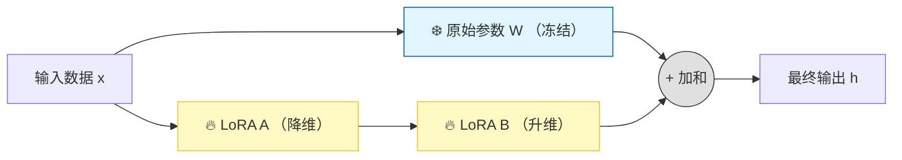

---


---


---

- 上上次总结
  - 梳理上周基于Qwen0.5B的生成式任务的评估结果。上周跑通了Qwen生成框架强化训练的实验，评估效果好的让人意外！训完发现Qwen训练难度会比Roberta高，但Qwen0.5B带的智力也要比Roberta0.1B高很多。目前的路由生成任务难度对之前的bert老模型或许还有门槛，但换到Qwen后路由组件匹配的准确率直接被0.5B的模型拉满了——说明对Qwen模型确实需要去提高任务难度
  - 整理当前迁移到生成式框架的RL训练代码，同时调试了一下之前搭建的基于查询结果的RL训练管线，为后续基于最终sql生成的端到端训练实验做准备
  
- 上次总结

  - 整理基于生成式强化学习任务的路由训练文档，然后同王工一块讨论确认接下来的RL研究的方向，考虑到现在训好的Qwen模型的能力已经完全高过了路由生成任务的难度，所以主要还是要进一步完成sql生成的这种更高难度的训练任务
  - 调试新建基于端到端的sql生成的强化学习项目环境，另外把之前搭建过的基于MQL查询结果的端到端管线重新调通，观察已经跑通的Qwen框架基于早期的简陋的端到端效果，这部分还在进一步调试，需要后续相应的实验观测才能有合适的结论
  - 然后也整理了一下晚上给软件部门培训的强化学习实践的培训讲解文档，详细分享自己在强化训练探索中遇到的坑，结合这次培训将其转化为团队的经验
  
- 总结

  - 上午帮忙处理之前CAD生图软件的生成数字格式显示的问题，摸索解决AutoCAD上进行配置的问题，同时更新dxf模板文件到最新需求的版本，目前这个CAD生图的支持问题已解决
  
  - 继续调研并构建基于端到端sql生成的Qwen模型强化学习训练方案，目前难点：奖励模块 + 数据构造模块，考虑的实现顺序：奖励模块 → 合成/筛选数据 → SFT → RL。其中奖励模块（规则优先 + LLM 兜底，后续再训练一个轻量 Reward Model (如 Qwen-1.5B)）、合成/筛选数据 (question, gt_result, gt_mql)（复用question生成管线，利用Agent查询执行并筛选大部分gt_mql与gt_result的数据，然后Gemini3合成进行badcase的补充兜底）、SFT冷启动（使用 (question, gt_mql)数据对训练）、RL（使用 (question, gt_result)数据对训练），具体细节方案还在进一步的调研完善
  
    
  




juierror/flan-t5-text2sql-with-schema-v2

Ellbendls/Qwen-3-4b-Text_to_SQL

Qwen/Qwen3-4B-Thinking-2507

Qwen/Qwen3-4B-Instruct-2507

Qwen/Qwen3-0.6B

gauravprasadgp/Qwen3-0.6B_nlp_to_sql

数据motherduckdb/duckdb-text2sql-25k


---


目前基于我们业务的表查询路由的强化训练流程能够跑通了，但是也遇到了强化训练中的卡点。现在我差不多也摸索清楚了强化学习的最大卡点有哪些，主要是合理基模的预选（平衡性能与算力数据要求）、数据集的构建（适配真实的分布情况）、奖励函数/模型的建立（模拟真实的反馈环境）

其中构建PPO训练的奖励函数的卡点在于，基于标准答案路径组件的匹配奖励机制难适配数据分布的真实情况，模型可能逮着一个“容易”得奖的组件使劲薅（例如单跳容易，模型就猛学单跳有关的组件奖励，而多跳的更多组件没照顾到），整体的准确率提升不明显


目前我结合一篇ACL中的生成SQL的强化论文总结了当前RL能够改进的方向主要在以下几点：

（换RL框架算法）在奖励稀疏的环境下（即许多早期查询失败的情况下），GRPO可作为专为噪声环境和有限成功率而设计的强化学习技术。针对Arctic-Text2SQL-R1的训练策略开始于对优化算法的仔细评估，发现GRPO 在 Text2SQL 任务上始终优于 PPO。

（换基座模型）像 OmniSQL 这样经过监督式微调的LLM变体——它们本身在指令执行和准确率方面就已表现出色——提供了显著优势。

（精筛数据）需要利用模型或者方法来验证合成查询数据，并仅保留高质量、正确的示例

（优化奖励机制）换成简单而直接的“生成值得信赖的 SQL 语句”，而不仅是语法正确的SQL，即最终的目标是让模型生成的SQL能够返回与标准答案相同的结果，而不仅仅是语法相似的查询语句（系统对比的是**SQL查询返回的结果**，而不是SQL语句本身）。因为不同的SQL语句可能产生相同的查询结果

（修改输入提示词结构）高性能的文本到 SQL 并非源于单一的突破。它需要将优质数据、智能初始化、合适的强化学习策略和精心设计的提示信息整合到一个统一的系统中


因为大模型困难不在于生成表面SQL的技术（例如略哥那边30B模型已经有八成成功率），而是SQL的执行逻辑。只要这个路由决策树逻辑训练通了，后续任意带逻辑的生成任务都可以用这种业务逻辑私有模型+大模型生成的机制

后续奖励机制尝试要换成简单而直接的“生成值得信赖的 SQL 语句”，而不是仅语法正确的SQL，在之前跑通的sql-rl-gen开源项目上试了一下目标明确单奖励稀疏的RL训练，效果如下（会出现批量成功、失败的情况）


所以关于这些问题想跟王工讨论一下，看看您这边对于RL训练有没有什么改进建议和指导，以及后续的规划安排


---


- CADAgent待办
- [x] 上线钉钉
- [x] 修复web 上先预览才能生成DWG的流程
- [ ] 更新下载按钮
- [x] 更新workflow_state.md
- [ ] **解决双机双网的第二个环网交换机的问题**
- [ ] 解决位置与端口标注（问一下吴晶晶要什么样的）
- [ ] 解决数量统计标注
- [x] 提供图元下拉选项
- [ ] 提供更多布局配置参数控制
- [ ] 调试字体显示效果
- [ ] 支持线型的调整
- [ ] **支持Excel中设备层的图元选型（目前仅提供33M）**
- [ ] 增加回路号是否为空的校验
- [ ] 增加厂房的序号校验
- [x] 监控设备的名称赋值问题（似乎被type错误替代了）
- [x] 修复图框属性值的硬编码填充问题


- 待办任务

- [x] 完成上半年工作总结（根据去年底的一对一绩效评估word）

- [x] 14号下午一年培训期谈话

- [x] 工程系列职称评审材料提交核对

  

- 意图识别待办

- [x] 分析王工在项目信息领域的意图分类、问题分类

- [x] 梳理发货领域的问题分类、每一个问题数据的意图分类

- [x] 发货问题打标，命名实体识别（NER）标注神器——Label Studio

- [x] 定义问题抽象板块。意图（query、static、judge、reason）-实体（）-属性-动作

- [x] 查看一下各个分类器的训练权重

- [x] 修改一下模型保存指令的保存地址

- [x] loss可视化

  - [x] 修复可视化加载log过时的问题

- [x] 针对grammar的优化训练

  - [x] 精选50个grammar的优质数据集（确定是容易分辨的，适合训练强化模型能力的）

  - [x] ~~（或者更简化-只保留query与reason）~~

  - [x] ~~把grammar多分类问题移到subdomain分类器上（这个subdomains单分类器是更简单、易处理的）~~

  - [x] 尝试删除unknown标签（本身数据中就不存在unknown情况）

    - [x] 为什么删除了grammar中unknown标签，inference还是能输出unknown呢？——可能原始的grammar多分类中就已经编码对歪了（因为之前会预测出未标注的unknown），需要排查一下

      - [x] 检查是否./dl_models/hfl/chinese-roberta-wwm-ext已经被污染了（现在原始的都一直预测为query），模型之前的保存方式是怎么样的？——正常
      - [x] 为什么训练验证集内部的数据也无法准确预测？（这个就是与f1分数相矛盾的——要检查代码）

  - [x] ~~加数据继续训练RobertaOnGrammar看看是否有改进 + 同时同步的挑选其他小模型看是否有更好的效果~~

- [x] 对于grammar问题：1、增加权重；2、增加数据量

  - [x] 先尝试从0.1到0.3再到1来修改权重影响——**没啥效果**
  - [x] ~~使用**带权重的交叉熵损失**——抑制模型总是预测多数类别~~
  - [x] 尝试只单独训练grammar分类器

- [x] 对于relation问题：1、对于无关系的relation增加负例标签/None标签；2、减小权重；

  - [x] **负采样**，使用脚本将没有标注实体之间relation的加上none的关系标签**作为负例的补充**，缓解"所有实体对都有关系"的错误学习模式

- [x] 对于数据历史标注准确性和分类占比

  - [x] **分阶段训练**。阶段1：专注于基础任务（实体边界 + 语法分类）
  - [x] 对于`size mismatch for entity_type_classifier.weight`的问题——原有训练模型无法适应新增entity的标注JSON（需要在新JSON上重新训练）

- [x] 优化训练的超参数组合（分类器权重+训练配置参数）

  - [x] 使用Optuna的贝叶斯优化库—与Huggingface集成比较好（需要根据之前的经验，设置合理的超参数搜索范围）

- [x] 扩充数据、标注数据

  - [x] 目前都是prj-id居多，还需要补充问题数据中的prj-name的实体问题（类似的还有其他常问实体的问题也要搜集补充）
  - [x] 使用Gemini等大模型进行清洗数据的标注准确性

- [ ] 目前发现训练的Roberta好像对于类似`发货流程卡在什么地方？`这种很“短”的问题上实体提取和关系抽取效果不是很好

- [x] 只处理简单问题（先上线意图识别）、加数据

- [x] 在 compute_metrics 中确保预测和真实标签使用相同的索引基准

- [x] 尝试不同的阈值，可能需要针对不同任务使用不同阈值

- [x] ~~实验label-studio的自动标注-基于spacy 的 zh_core_web_sm~~

  

- [x] 可以先不管relation的分类任务（把这部分的分类器注释掉）

- [x] 解决entity识别正确性的问题

  - [x] 后续可以考虑用lora方式先把grammar与subdomains冻结起来（不再使用staged training）
  - [x] 把多问题的样本剔除或者拆解分开
  - [x] 检查当前eval的F1计算是否合理，F1值确实太低了（不合理情况）
    - [x] 探索是否需要更换eval的评价方法
      - [x] 就是这两个新加的F1值计算问题很大span_type_losses与relation_losses（代码为什么是单独的（疑点）？能否与position loss一致保持简洁？）
        - span_f1 = f1_score(valid_true_span_ids, valid_pred_span_ids, zero_division=0, average='weighted')有问题
        - relation_f1 = f1_score(valid_true_relation_ids, valid_pred_relation_ids, zero_division=0, average='weighted')
    - [x] **或者更换随机搜索的优化目标（从综合F1换成验证集loss）**——评估指标好，但实测效果不好，基于evalLoss似乎会导致模型避重就轻，忽视难任务的loss训练

- [x] 研究label studio的基于预训练模型的半自动数据标注方法

- [x] 先上线当前多任务的最好的训练结果的模型的推理接口

- [x] 解决生成的偏好数据中relation的idx都为0的问题

- [x] 探索强化学习RL在entity/relation上训练的路线与效果

  - [x] 搭建DPO训练的偏好对数据集——基于规则与F1统计指标的筛选方法__F1指标还得和AI讨论一下，不然单样本正常F为1的情况很多
    - [x] F1为1情况很多，但是不影响，基于单样本F1值，**(TP)**：模型正确预测的槽位数量。**(FP)**：模型预测出但实际不存在的槽位数量（“幻觉”）。**(FN)**：真实存在但模型未能预测出的槽位数量（“失明”）。可以通过F1去综合精确率与召回率来筛选出与真实样本对比效果不好的数据（规则筛选中不好匹配比对真实样本的情况）
  - [x] 搭建generated_samples_for_sentence脚本（真实样本、基线预测样本、扰动样本、阈值探索样本、极端错误样本 ）——训练奖励模型所需的数据（为一个句子生成5-10条扩充训练数据）
  - [x] 生成偏好对的脚本中随机损坏策略（如生成实体）是有问题的

- [x] 整理RL目前的探索——与王工讨论

- [x] 探索当前意图识别模型在项目助理任务中评估方法

  - [x] 构建意图与槽位case的知识库——使用多维表格管理（方便未来RAG/SFT）
    - [x] 扩展测试数据——从“用户会怎么问”的常规思维，扩展到“用户可能会怎么问，甚至是怎么问错”的极限思维。

  - [x] 评估流程（可复用的标准步骤）数据读取 → 批量推理 → 结果对齐 → 指标计算 → 误差分析 → 报告生成。
    - [x] 评估方法优化。新增 Partial-IoU（实体重叠率大于0.5都算tp=1） 和 Semantic（实体有包含关系算tp=0.8，全等算1） 包含两个补充评估指标


- [x] 清洗现有数据 (评估集优先)
    - [x] 确保评估集是**100%准确的“黄金标准”**。
    - [x] 结合评估的badcase一步步对照着去清洗训练集进行重新微调
    
- [x] 调研构建意图识别任务领域label体系的传统方法——无系统性技巧发现

- [x] 增加最新的表结构实体到label体系中去
    - [x] 手动测试自动标注转换工具是否准确
      - [x] datasets/my_roberta_v2_traindata_entity_relation_only.json
      - [x] datasets/my_roberta_v2_traindata_0724_ALL_negative_noStatistic.json
      - [x] 不需要deprecate，确保原始标注所有label都可以完成转换
    - [x] 之后再开始新增标签的标注+ aug trial去重（如物料清单、）审查新label体系是否存在交叉重复
      - [x] 接下来你需要仔细审查新label体系datasets/entity_labels_v2_final.json中是否存在交叉重复或者其他有可以优化的标签内容
    - [x] 另外一个vscode调试DPO训练流程
    
- [x] 意图识别api的落地
  - [x] 整理新框架下的意图识别api给到和加入略哥他们的工作流中
    - [x] 通过装饰器套件进行request通信 或者curl指令方式
  - [x] 了解雷鹏那边的意图分类的数据与输入输出流，看能不能也加入Roberta的接口
    - 意图：提到RAG系统是基于大模型分三类意图：chat、download、query。先对用户问题进行三分类，再考虑回答，且会拼接约多条历史记录辅助识别意图。
    - 槽位：槽位范围大，用户输入模糊，难以精准提取，**且相近型号易出错**。RAG组通过决策树设定节点，引导用户补充问题信息，大模型根据信息做决策，虽槽位识别非精准提取信息，但决策准确度较高。
      - RAG 检索痛点问题：
        - **检索误差**：RAG 本身是概率性检索，相近型号和版本号易导致检索太多，无法控制token，如 5100 和 5100G、不同版本号等情况。
        - **权重识别需求**：检索时需识别关键词权重，避免因分词权重相同导致相似度误判，但实现难度较大。
  
- [x] 意图识别是分为多级意图分类（如grammar+subdomain：查询-发货/基础信息）+ **槽位提取**（抽象的槽位类型 -一级类别-二级类别-具体对象）

- [x] 研究一下当前Roberta模型网络结构下span识别为什么会出现span重叠的情况

- [x] ~~调研一下laminar如何通过API的方式获取执行的之间过程结果~~

- [x] _extract_agent_behavior_from_spans有bug，似乎都被语义识别的回答拦截了——修复歧义问题的识别评估失效的问题

- [x] 构造L3的语料（含complete属性、关键组件）——并搭建多维表格自动生成提示词

- [x] 在README中进一步细化黄金语料的与spans中的信息匹配用法

- [x] ~~进一步优化AI表格的cypher生成与laminar中实际cypher匹配度，同时考虑是否缩小cypher关键组件匹配的范围（突出“关键”，同时减少匹配对象波动太大问题）~~

- [x] 先和王工讨论一下他的意见，说明一下当前难点

- [x] 看是不是先从**查询可生成性判断准确率**、**Cypher语法通过率**这两个容易的先去优化；**Cypher关键组件验证通过率**太灵活了（待王工意见）
  - 先介绍为什么挑选了这三个作为指标（考虑到什么原因）
  - 再介绍前两者好调试，难点是第三个指标的组件不好选定-展示生成组件与Agent的组件的区别截图
  - [x] 王工的意见是，需要确定助理Agent中不变的（cypher可能会换）元素进行评估
    - [x] 评估集还是得构造，可以不多但是要精（先让AI整3-5条黄金标准评估数据）
    - [x] 问一下A组的sql数据怎么获取
  
- [x] 重新构建针对多LLM的多层评估的语料集，L3与L4的评估语料可以重构且合并，L1语料可改变类型分布

- [x] 再挑选一些对比的LLM，要求控制对比的变量（系列、size、特化类型）

- [x] 重构L1层的评估，将cypher识别整合到L1中，并调整优化L1的新报告生成

  - [x] L1管线修复-分三个subAgent的三个独立评分指标
  - [x] 数据优化——问一下Gemini最佳的L1数据分布构建
  - [x] 平台选取及报销——openrutor、云雾（打折优惠的中转API平台）——云雾的得等到11月初才能开发票
  - [x] 看一下L3测试语料为什么还有无效问题
  
- [x] 尽可能的梳理当前A组可用RL升级替代当前Agent节点的环节有哪些，整理一版可能的多个研究方向（不用含太多技术细节）然后跟王工与略哥他们讨论对齐一下

  - [x] 从流程环节上有哪些RL方向
  - [x] 从问题类型上有哪些RL方向（简单查询问题、复杂查询问题、为什么的推理问题）
  
- [x] RL的增量研究路线可以，但是改进用的action空间需要重构，因为有些查询是复合动作（prompt中有fewshot示例）

    - [x] 可以单独抽出节点4的prompt进行模拟，然后使用mongodb的数据库地址自助利用python脚本验证查询结果
    - [x] 作为优化prompt用的action空间需要先进行**A/B测试**等方式验证对badcase确实有提升效果（使用badcase测试集评估——改进前原始prompt vs 改进后嵌入优化的prompt）
    
- [x] 用RL跑通一个游戏——掌握技术

- [x] 找一个与我们业务类似的开源RL训练案例（含数据）

    - [x] 差不多理清了当前sql-rl-gen的实现流程与原理——现在可以做一个流程图（汇报用）、复现效果（演示用）
    - [x] 优化流程图；优化开源项目演示的脚本


- [x] 或者直接上真实场景，使用AI表格构造路径查询的数据进行初步的RL训练实验（换为真实数据、和Roberta基础模型）业务场景：Router智能决策层

  - [x] 优化自动标注路由的AI提示词
  - [x] 并行内容有，构建**业务RL训练（Text-to-MQL策略）**的数据、基模、训练框架
    - [x] ~~数据——使用PMS的真实数据构造问题（由答案反向构造问题-LMArena，prompt需要表结构和）、使用多维表格对问题批量的构造查询路径~~
      ~~baseline是可以直接从工作流中提取出原始Agent使用查询路径~~
    - [x] 数据——先用表结构构造路径（控制好分布）；再用路径构造问题变体（控制好多样性比例）-LMArena
      - [x] 构建的合法path有问题（原始graph有问题），project表下并没有contract，而且大部分表还有对应的【change_log】表
    - [x] 重构一下项目文件路
    - [x] 了解SFT与RL训练数据是否需要划分的问题
      - [x] 新生成的数据集（测试集）需要在baseline、SFT、RL上分别跑出得分结果——下周二汇报展示
      - [x] 目前已经实验了SFT在RL新数据上路径匹配ACC在98%，下面要看一下baseline逆向的路径匹配ACC是多少？（对比-阶段性可用结果、汇报）
    - [x] 了解关于pass@k与pass@1是否有训练上的差异——训练不需要pass@k，推理和评估可以pass@k看看是否模型存在阶段性遗忘或者犹豫不定的情况
    - [x] 了解新的三头actor与gym单头有什么区别和影响
      - [x] 单头: BERT → [共享的256维空间] → 切分输出
        三头: BERT → [独立的256维空间 × 3] → 各自输出
        **SB3 仍然非常适合**。我们只是需要自定义网络结构，虚拟特征提取器只是"骗过"父类的硬编码初始化检查
      - [x] 了解为什么当前初步的三头RL训练在500步之后奖励就崩了（刚好样本集也是500多）——因为奖励值 (Reward) 过大，巨大的 Value Loss 击穿了 Backbone（因为**第 512 步发生了第一次梯度更新**，模型瞬间崩溃。），Backbone 的特征提取能力被 Critic 的梯度瞬间破坏。依赖于这些特征的 Actor (SFT 权重) 也就随之失效，输出变成了随机乱猜，准确率瞬间跌至 0.12 (随机水平)
    - [x] 奖励机制——少用正奖励，多用负奖励（尝试只有全对才有大奖，其他错误都是负奖），因为**正向奖励可能正在扼杀模型的探索潜力。**其次奖励不能过大（不然优势函数的梯度会崩）
    - [x] 还得使用GRPO进行RL训练实验
      - [x] 基模更换（bert、T5、Qwen0.6）——难点在于SFT要作为前提（要找一下是否有SQL微调的版本）
        - [x] 从huggingface下载必要的模型
      - [x] 所以先要实验Qwen+PPO的过程（尝试重构项目从分类任务到生成任务）——因为分类任务对分类结构要求太高了，编号一改变就全错了，生成任务泛化性更好，少量表变动也能生成正确内容
        - [x] 当前跑通了TRL生成任务的SFT与PPO训练，但是还得**消化一下，完善文档**
        - [x] 参考之前使用SB3进行PPO训练的结果保存的版本管理办法——升级当前TRL训练的保存逻辑
        - [x] 初步调试好一个SFT生成的高ACC，但是其中的generated_text似乎是有问题的，生成的text乱七八糟
        - [x] 查看之前评估管线并构建好Qwen vs Roberta的新评估管线
      - [x] 然后再Qwen+GRPO（因为GRPO默认适配文本生成任务）
    - [x] 写一个当前跑通PPO+Roberta的训练**总结文档**——多总结记录
      - [x] 写年终总结
      - [x] 隔离环境，更新基模，开发Qwen+PPO


- [x] 或者还是并行，模拟实验继续探索其他RL算法（反正框架也搭好了，只需要微调部分板块即可）
  可快速产出可视化结果<br>- 算法对比有图有故事（上级关心换算法能否解决当前汇报过的问题-如reward hacking和不收敛）<br>- 操作熟练度提升
  **- 周二汇报要讲成一个“有头有尾的”故事（任务是什么、具体要干什么、结果怎么样、后续思考-比如RL实验四步走）**
  - [ ] 整理最新的周报助手的promt，先让他们提炼，然后stacking生成——要求最后风格能够尽量兼顾大局（讲好story与任务推进），就像今天一样不陷入到汇报各种细节，而是让领导知道大致做了啥（挑重点细节来讲），以及我们当前在哪一阶段（比如我今天提出了RL实验四步走（RL训练Roberta分类路由任务0.1B → RL训练Qwen生成路由任务0.5B → RL训练局部sql生成任务4B → RL训练全量SQL生成任务4B/7B（含算力处理）），那我们现在就是在做第二步，领导一看就知道我们在什么研发状态，以及我们重点做了啥）
  - [x] 汇报点：对于生成任务的初训练——Qwen学习路由并生成JSON能力更强更准（摸索发现：比起Roberta多了一个训练对齐的难点，生成会自作主张），这对后续RL训练生成完整且更复杂的sql是个好预兆
  
- [ ] 构建基于端到端sql生成的Qwen模型强化学习训练——难点：**奖励模块 + 数据构造模块**

  - [ ] 实现顺序：奖励模块 → 合成/筛选数据 → SFT → RL

    - [ ] **奖励模块（规则优先 + LLM 兜底，后续再训练一个轻量 Reward Model (如 Qwen-1.5B)）**
    - [ ] **合成/筛选数据 （复用question生成管线，利用Agent查询执行并筛选大部分gt_mql与gt_result的数据，然后Gemini3合成进行badcase的补充兜底）**(question, gt_result, gt_mql)
    - [ ] SFT冷启动（使用 (question, gt_mql)数据对训练）
    - [ ] RL（使用 (question, gt_result)数据对训练）

  - [ ] 扩充q-r**数据集**的生成+筛选——可以参考之前的从答案分类出发的合成方法+已有好查询结果的优质sql筛选法
  - [x] 端到端的**奖励**模块，从多个角度进行 **多级/混合** 打分

    - [ ] 从sql语句层，使用规则检测 路径 + filter条件 + 表关键词
    - [ ] 从返回结果层，使用LLM+人的stacking集成学习的打分过滤法


### A. 奖励信号的"金字塔"设计

```python
Level 4: 执行结果完全匹配/业务语义匹配 (最强信号，但最难获取) ( Qwen-72B 作为裁判模型，输入 (question, gt_result, pred_result) 判断等价性 )
   ↑
Level 3: 执行成功 + 关键字段覆盖 (中等信号)
   ↑
Level 2: MQL 语法正确 + 表/字段合法 (弱信号但易获取)
   ↑
Level 1: 格式可解析 (最弱信号)
```

### B. 数据集构建的几种思路

| 思路                     | 优点           | 缺点               |
| ------------------------ | -------------- | ------------------ |
| **人工标注 GT MQL**      | 质量高         | 成本高、规模小     |
| **从执行日志挖掘**       | 真实分布       | 可能有噪声         |
| **LLM 生成 + 人工筛选**  | 规模大         | 需要质量把控       |
| **基于 Schema 自动生成** | 可控、可大规模 | 可能与真实分布偏离 |

1. **先用 SFT 建立 Baseline**：用 Stage 1-3 构建的数据做 SFT
2. **再用 RL 做增强**：用执行结果作为奖励信号做 PPO
3. **最后做 RLHF 对齐**：如果需要更精细的业务对齐

generated_text 看起来很混乱

用这条 sample_0195 把“当前 SFT 运作流程”串起来（从数据到 loss，再到你看到的 generated_text），会有影响，但不是“必然把 PPO 搞坏”，而是更像“增加训练噪声/成本”。

把全过程用一句话串起来：

- 数据侧：text = prompt(…</instruction><output>\n) + completion(JSON)
- SFT 训练侧：模型吃 text，但 completion-only 把 <output> 之前 labels 全 mask，只对 JSON token 算 loss
- 推理侧（你现在看到的）：build_prompt(question) → tokenize 可能截断掉 <output> → generate 先补 </instruction><output> → 输出 JSON → 继续生成一些 Human: 噪声
- 评估侧：解析器从 generated_text 抽 JSON，对比 ground truth 得出 exact_match=true

解释两大根因：prompt 截断把**包括** **`<output>`** **及其前面的** **`</instruction>`** **尾巴**截掉  +  未设置 stop 导致完成 JSON 后继续生成

QWEN_MODEL_PATH = /root/repos/RL_MQL_Semantic_Router/dl_models/Qwen/Qwen2.5-0.5B-Instruct
config class: Qwen2Config
**cfg.max_position_embeddings = 32768**
cfg.sliding_window = None
tokenizer class: Qwen2TokenizerFast
tok.model_max_length = 131072
tok.truncation_side = right
tok.padding_side = right


| 方法         | Full Match Rate | 特点                   |
| ------------ | --------------- | ---------------------- |
| **RL-Qwen**  | **100.00%**     | 🏆 最佳（路由JSON生成） |
| **SFT-Qwen** | **100.00%**     | 🏆 最佳                 |
| RL-RoBERTa   | 85.71%          | +3.57% vs SFT          |
| SFT-RoBERTa  | 82.14%          | 路由分类-后训练        |
| baseline     | 28.57%          | 纯LLM+prompt约束       |


### 关键发现：

1. **Qwen 模型全面领先**：SFT-Qwen 和 RL-Qwen 都达到了 100% 完全匹配率
2. **Qwen vs RoBERTa**：Qwen 优势 **+14.29%**
3. **SFT vs RL**：
   - Qwen: 两者持平 (100% vs 100%)
   - RoBERTa: RL 提升 **+3.57%** (85.71% vs 82.14%)
4. **错误模式分析**：RoBERTa 模型主要在 `via` 字段出错，经常错误地预测中间表（应该是 `"null"` 时预测了 `construction_contract` 等）


---

从 LunarLander 到 Text-to-MQL：PPO 强化学习技术探索与避坑指南

强化学习工程实践：环境建模、Reward 设计与 PPO 稳定训练（含故障手册）

强化学习入门实战：从游戏 Demo 到业务 RL 训练的全流程拆解


# 从 LunarLander 到 Text-to-MQL：PPO 强化学习技术探索与避坑指南

---

## 📋 培训介绍

> 本次培训是一次 **RL（强化学习）技术试验的全流程复盘**。
>
> 我们从 HuggingFace 的 LunarLander 小游戏入门，到复现 IBM 开源的 sql-rl-gen 项目，最终在业务场景（Text-to-MQL 路由决策）中跑通了 SFT+PPO 训练流程。
>
> 培训将重点分享：**RL 核心概念的工程直觉**、**PPO 训练崩塌的根因与稳定性配方**、以及**可复现的代码与配置**。
>
> 适合对 RL 技术感兴趣、希望了解"RL 在 NLP 任务中怎么用"的工程师。无需 RL 基础。

---

## 🎯 培训目的

| # | 目的 |
|---|------|
| 1 | **建立 RL 直觉**：理解 SFT 与 RL 的本质区别（"背答案" vs "做练习拿分"） |
| 2 | **掌握避坑经验**：了解 PPO 在 NLP 微调中的常见失败模式及工程化解法 |
| 3 | **沉淀可复用资产**：获得一套从 SFT 冷启动到 PPO 稳定训练的配置模板与排障手册 |
| 4 | **降低技术尝试门槛**：为后续团队内 RL 相关探索提供参考路径 |

---

> 💡 **一句话总结**：分享 RL 技术从入门到业务跑通的完整路径，用 1 小时，把我踩过的坑变成团队的经验。

---


---

背景：辅助项目助理Agent生成SQL的查询路径强化训练。解决LLM不理解SQL背后查询逻辑的问题
RL输入：问题+schema，输出：业务路径+奖励值

- **数据集与训练管线完善**: 重新优化了一下数据生成管线，给RL生成单独的 566 条Question-Path新样本。其实之前SFT阶段已有560样本（504训练集，56（全局）测试集）

  - 

- **SFT冷启动+PPO验证：**  SFT提供了0-1的基础理解能力；PPO提供了1-3的举一反三能力，对比项目助理基线**Full Match 提升 53.57 个百分点**

  - 
  - （真实测试样本对比）
  - 
  - 

  

  - 同时也相当于验证了一件事，至少在当前任务上SFT冷启动是不可少的（0.9+的ACC起点），然后RL也进一步后训练提高SFT的ACC以及对新数据的泛化能力

  - **验证发现1：**在新数据与框架下验证了“先SFT后RL”的必要性，直接RL训练前20000步几乎学不到有效奖励；

  - 

  - **验证发现2：RL摸索中，发现RL训练难度相比SFT较高，很容易崩、**容易练着练着忘掉SFT学好的知识，对强化训练的数据好坏、参数配置、**奖励设计**要求非常高！

  - 

  - 调整奖励机制在规模10以内、调整训练超参数lr、kl等等配置（防止第一次PPO更新后优势函数梯度爆炸）

  - 

  - 

    

- **模型对比评测初步分析：** 完成Baseline/SFT/RL三方评测。SFT/RL较Baseline全匹配率（Full Match）提升**53.57%**。针对RL奖励过大导致的灾难性遗忘问题进行修正，将Via（途径表）预测准确率稳定在**85.71%**。

  - 

## 附录: 方法说明

| 方法         | 描述                                                 | 模型架构         |
| :----------- | :--------------------------------------------------- | :--------------- |
| **Baseline** | 调用 LLM API (Qwen) 生成 MQL，再提取 Collection Path | LLM + 正则提取   |
| **SFT**      | 监督微调的 Roberta 分类器，直接预测三元组            | BERT + 3 分类头  |
| **RL**       | 基于 PPO 强化学习微调的路由器                        | PPO + SFT 预训练 |


【本周计划】

- 进一步扩充数据集，同时实验调试当前奖励函数与超参数，提升复杂多跳场景下的泛化能力。
- 实验更换RL算法，补充GRPO等前沿的强化知识，解决PPO训练易崩问题
- 实验更换编码模型Roberta到生成模型Qwen0.3B的RL训练


### 数据维度上的“重复利用”

PPO 的核心是：

- 使用 old policy 采样得到的一批 [(s,a,r)](vscode-file://vscode-app/e:/vscode/Microsoft VS Code/Microsoft VS Code/resources/app/out/vs/code/electron-browser/workbench/workbench.html)，
- 用重要性比率 [π_new(a|s)/π_old(a|s)](vscode-file://vscode-app/e:/vscode/Microsoft VS Code/Microsoft VS Code/resources/app/out/vs/code/electron-browser/workbench/workbench.html) 和 clipping 来更新参数，
- 同一批数据可以在 **多个 epoch** 里反复使用（提高数据利用率）。

> 在sql-rl-gen这个项目里，这点依然成立：
>
> - 对于每个 (observation, generated SQL, reward) 样本：
>   - PPO 内部会在 [epochs](vscode-file://vscode-app/e:/vscode/Microsoft VS Code/Microsoft VS Code/resources/app/out/vs/code/electron-browser/workbench/workbench.html) 轮中多次遍历这批数据做梯度更新。
> - 这就是“同一条数据多次使用”的地方，而不是在环境里再跑一次 episode。

## 再用一个对比 LunaLander 的类比总结

你可以这样对比，帮助直觉：

- **LunaLander：**
  - 每一步 action：发动机推力（连续控制）。
  - 同一条轨迹里，会不断调整推力直到落地或坠毁。
  - reward 在时间上分布，episode reward 是多个 step 的和。
- **本项目：**
  - 每一步 action：一整条 SQL（宏动作）；
  - 没有在“同一个样本上反复试”这条长链条，
    但有**很多个样本**和**很多轮训练**，跨样本与跨轮次形成试错过程；
  - reward 只在后面一次性给出，但 PPO 通过多轮遍历同一批数据（重要性采样 + clipping）进行稳定更新。


---


---


### 1. 核心挑战：当前Agent路由的“业务逻辑”瓶颈

- **现状：** 我们当前的LLM Agent在处理“Text-to-MQL”任务时，**严重依赖Prompt，缺乏对复杂业务逻辑的“可控”理解。**
- **痛点：** 导致查询**路径不稳定**、成功率低，**且难以归因和优化**。
- **目标：** 我们需要一个“**可训练、可迭代”的策略引擎**来接管“路由决策”。


## 🧭 推荐策略：**主打方向① + 包装方向③ + 预告方向②**

汇报方案如下：

1. **核心成果展示 → 来自方向①**
   “模型自我策略优化验证”PPO/SAC实验，可视化好看、容易讲。
   汇报时包装成：“我们已在验证模型自主学习框架，为下一阶段业务任务做RL技术预热。”

>  **成果1：完成V3技术验证**
>
> 成功构建了一个“高保真”模拟环境（V3），它100%复刻了我们`[Module, Anchor, Target]`的`[5, 10, 10]`高维动作空间和“路径约束”。模拟RL训练发现**最佳模型(在第40万步)能达到92%成功率**,其中87%是首次尝试成功!
>
> **结论：** V3实验证明，PPO算法**可以**被训练来100%遵守我们的“业务逻辑”，并精准输出结构化的动作。（*这就是您V3实验的唯一价值！*）

1. **战略落地延伸 → 借方向②**
   可附一句报告中提到：

   > “我也在调研开源RL在NLP任务上的工程实践（例如sql-rl-gen这个项目）
   >
   >  **成果2：跑通并验证了PPO可以很好的训练单回合制的SQL生成任务**
   >
   > 基于IBM开源的sql-rl-gen项目和主流的Spader数据库查询数据集，实现了在现有小模型的基础上，再用“执行结果是否正确”来做强化学习微调
   >
   > ## 
   >
   > - 在简单问题上，模型已经可以稳定给出与标准 SQL 完全一致的结果；
   > - 在稍复杂（排序、多列）的场景下，模型也能正确生成；
   > - 当遇到语义模糊或字段定义细节问题时，模型会出现“似是而非”的错误；
   > - 强化学习通过“执行结果 + 奖励”的机制，自动放大奖励高的写法，压制错误写法，持续提高模型对业务查询的可靠性。

2. **延展想象展示 → 来自方向③**
   展示 Text-to-MQL Router 的结构图，配上“下一阶段RL应用构想图”
   不需实现，只需画逻辑图 + 写小部分伪代码（展现你已在准备，准备了完整的框架图，后续只需要构造合适的数据集进行实验）


---


---


## 📚 开源项目推荐（方向2的参考）

### **选项A：Text-to-SQL + RL（最相关）**

```
GitHub搜索关键词：
- "reinforcement learning text-to-sql"
- "RL query generation"
- "semantic routing RL"
```

推荐项目：

- **BIRD-SQL** 或 **Spider** 数据集的RL方法实现
- **SeqZero**（Seq2Seq + RL优化）

### **选项B：工具调用Agent（逻辑相似）**

```
关键词：
- "LLM tool selection RL"  
- "ReAct Agent reinforcement learning"
```

推荐：

- **Langchain-RL**（虽然简单，但逻辑类似）
- **Toolformer**相关实现

### **选项C：意图识别 + RL（技术层面）**

```
关键词：
- "intent classification reinforcement learning"
- "dialogue policy learning"
```


## 根本问题分析

我意识到这个任务的**设计存在根本缺陷**:

- **观测空间(64维)远大于动作空间(3维)的信息量**
- **固定线性编码器**从3维映射到64维,然后加噪声,agent需要反向学习这个映射
- **这本质上是一个过度参数化的记忆任务,而非强化学习擅长的决策任务**

### 关键发现

1. **最佳模型(40万步)达到92%成功率**,其中87%是首次尝试成功!
2. **简化观测空间是关键** - 从64维神经网络编码改为25维one-hot特征
3. **训练步数存在最优点** - 40万步最佳,50万步反而过拟合

### 🔑 **关键经验**

1. **环境设计比超参数更重要** - 合理的观测空间设计胜过大量调参
2. **one-hot特征 > 神经网络编码** - 对于离散动作空间的映射任务
3. **early stopping很重要** - EvalCallback自动保存最佳模型,避免过拟合
4. **噪声水平要匹配任务** - 0.03对于25维one-hot特征是合适的平衡点


### 📋 下一步建议

**阶段1: 验证问题严重性**

- 检查4个不匹配样例的MongoDB返回结果
- 分析路径错误是否导致:
  - 返回了错误数据(如S3-02返回合同本身而非变更记录)
  - 返回空结果(如S3-03、S3-08)

**阶段2: Router训练目标明确**

- 重点训练Router在S3切片识别"变更"语义→`contract_change_log`
- 教会Router区分Type A(直接起点)和Type B(需跳转)两种模式
- 期望Router将Via准确率从80%提升到95%+

**阶段3: 对比实验设计**

- 用相同20个样例测试Router + Node4
- 对比CollectionPath匹配率: Baseline 80% vs Router ?%
- 证明Router是否能修正Baseline的系统性路径错误


A组的全局目标是打通当前问题分支的60分（当前的记忆模块），以及扩充处理的决策树分支的问题类型

A组当前需要：设计出来的RL方案必须是可以集成到当前Agent框架的五个节点之一的（满足可用性）——即当前RL的研究方案必须围绕Agent五个节点去增量升级

A组当前痛点：mongodb节点生成不准（需要哪些升级？RL？对抗训练？转DSL？冗余LLM监管...）；prompt太多了（需要训练内化？或者其他集成形式？要语义层？）

A组决策树还没开展、上下文优化被刘总暂时否了

A组可用的参考数据只有laminar中的哪些记录


L组的需求是调研收集哪些模块是可以用RL去提升的（目前两个方向）

基于Agent的工作流，存在以下两个主要的、有价值的强化学习应用点：

1. **`A. L1/L2 - 对话策略优化 (Dialogue Policy Optimization)`**: 优化Agent在“输入处理与对话引导”阶段的决策能力。这是一个经典的**对话管理 (Dialogue Management)** 问题，核心在于学习一个最优策略，以最有效的方式引导对话，从而收集到足够且准确的信息。
2. **`B. L3 - MQL查询生成优化 (MQL Generation Optimization)`**: 优化Agent在“查询生成”阶段的能力。这可以被看作一个**结构化语言生成 (Structured Language Generation)** 问题，核心在于学习一个策略，将自然语言意图准确地映射为可执行的、正确的MQL查询语句。

- 引入RL优化MQL生成的查询路由决策（当前“NL→MongoDB 生成器”由大量Prompt指导生成JSON查询，需要RL来辅助LLM提升查询业务口径与查询范式的路由选择决策能力）
  - **与现有架构无缝集成**: 该RL Agent可以作为一个新的、轻量级的决策节点，插入到现有流程中。它接收“问题归一化器”的输出，其决策结果（选择的口径或范式）可以直接作为“NL→MongoDB 生成器”Prompt的一部分，指导其生成最终的MQL，完美嵌入当前架构。

问法-当前整理的针对输入的决策树推理RL是否有效
A组认为可能合适推荐的RL替换点有哪些（是否有完全的框架流程图）？-我再基于这些突破点去调研可行性

- [ ] 从流程环节上有哪些RL方向
- [ ] 从问题类型上有哪些RL方向（简单查询问题、复杂查询问题、为什么的推理问题）

在输入处理阶段，Agent的核心职责是通过多轮对话，引导意图模糊的用户，在一个预定义的“项目问题决策树”上进行推理，最终明确其真实需求。

RL黄金突破口：

1. **节点4**：结构化生成与候选重排（直接提升MQL正确率）
2. **节点5代行L1/L2**：澄清/引导策略（减少slot-error，缩短轮次）
3. **节点3**：RL优化实体识别与问题拆解（已有部分实体识别经验）

MQL查询生成RL优化的难点在于RL环境不好获取，A组是否可以提供合适的RL训练反馈的环境（当前工作流能改不？）

RL优化实体识别与问题拆解（已有部分实体识别经验），虽然不局限于工作流，但是难点在于之前旧的实体体系又得重新与A组同步


---


---


---

**奖励：查到正确答案+10，查错-1，每步-0.01（鼓励最短路径）** 非稀疏奖励

先做一个极简、可快速上线验证价值的 Router。仅围绕三大歧义 A+B+C（主体 Anchor、口径 Module、路径 JoinPath）做单步路由决策；输入来自节点3归一化问题+对话上下文槽位+固定的关系图；输出为精简的结构化JSON（Format 2），注入节点4 Prompt 的位置B（输出格式之后、总则之前）；节点4保留采纳/否决/纠错权；训练流程分三步（小样本SFT → 真实执行回传的RL微调）。

---

**RL策略**：

- **State**：“归一化问题 + schema_text + project_id（可选）”

  - 示例
    {
    "norm_q": "项目I-23112109的物料细化是否已完成？",
    "schema_text": "<节点4 user prompt中的表结构+关系+模块规则全文>",
    "project_id": "I-23112109"
    }

- **Action**：Action 只输出“Module + JoinPath”两部分，其余细节（数组策略/字段裁剪/排序）由节点4“总则”负责

  - Module：告诉节点4是否触发“业务口径模块”（节点4有专门段落）

    - 口径与入口集合关系（给定的四类 + 通用）
      - unshipped：未发货/发货比例/是否发完/还剩多少 → 典型 start=contract_bom, target=none
      - fees：服务费/采购费/交通费/检测与认证费 → 典型 start=contract_bom, target=none
      - systems：监控系统/软件系统/软件模块/驱动 → 典型 start=contract_bom, target=none
      - material_refinement：物料细化是否完成 → 典型 start=contract_bom, target=none
      - generic：其余非特殊口径 → start/target 由语义决定（变更/发货申请/发货执行等）

  - JoinPath：告诉节点4“从哪张表起步 + 按范式A怎么走到目标表”，直接对应节点4的“跨集合与多跳”段落与collection起点选择

  - ```python
    Action = {
        "Module": str,           # 业务口径
        "CollectionPath": {
            "anchor": str,       # 入口集合（节点4的collection字段）
            "target": str,       # 目标集合（最终要查的数据所在表）
            "via": List[str]     # 关联路径（为空表示单表查询）
        }
    }
    ```

    

- 注入采用结构化JSON（Format 2），插在位置B

- 奖励只看 Compass 执行成败 + 路由一致性，先不引入更多复杂信号

- Reward

  ```
  reward = {
      +10: MQL执行成功 且 返回正确结果
      +3:  选择了索引字段（高选择性）
      +2:  路径简洁（无冗余$lookup）
      -5:  执行失败
      -2:  路径冗余（多余关联）
  }
  ```

**关键价值**：在歧义场景选择**信息最丰富且唯一可达**的路径。

```markdown
用户输入 → 节点1(校验) → 节点2(消解) → 节点3(归一化)
                                              ↓
                                    🎯 Semantic Router (RL核心)
                                              ↓
                        【A.主体歧义】合同的项目经理 → 起点应查project还是contract?
                        【B.口径歧义】物料细化完成 → 用哪个业务逻辑判断?
                        【C.路径歧义】项目→合同→变更 → 单跳还是多跳?
                                              ↓
                            生成结构化指导JSON (Format 2)
                                              ↓
                            注入节点4 Prompt (位置B: 总则之前)
                                              ↓
                                    节点4(MQL生成) → MQL
                                           ↓
                                         [MongoDB真实执行] → 结果
                                           ↓
                                         [AI评估 + 人工抽检] → 奖励信号
                                           ↓
                                         更新Router模型
```

合法典型

- 变更：start=contract, via=[], target=contract_change_log
- 发货申请：start=contract, target=delivery_request
- 发货执行：start=contract, target=delivery_order
- 项目→合同：start=project, target=contract
- 四类模块：start=contract_bom, target=none

阶段2 监督学习（SFT）

- 输入：{norm_q, schema_text, project_id?}
- 输出：{module, join_path.start, join_path.via, join_path.target}
- 小模型即可（如6B以下），训练为分类+序列结构填充（via可用序列多标签或受限解码）

训练脚本
• SFT：多头分类/受限解码
• RL：基于奖励表的Bandit/REINFORCE loop


---

【Router Guidance（可选 - 若提供请严格遵守）】
- Router_output 格式 (JSON):
  {
    "Module": "<module name>",
    "CollectionPath": {
      "anchor": "<anchor_collection>",
      "target": "<target_collection>",
      "via": [ "<via_col1>", ... ]
    }
  }
- 注入说明:
  1. 若提供 Router Guidance，请将下列要点视为“必须遵守”的约束，先于你的生成逻辑应用：
     - 首先以 Router 指定的 `CollectionPath.anchor` 作为 pipeline 的 entry collection（collection 字段）。
     - 若 `CollectionPath.target != CollectionPath.anchor`，优先考虑使用 `$lookup` + `$unwind`（或范式A允许的子管道）来实现跳转，除非问题语义明确要求“count/size”类不展开统计。 
     - 当 Router 建议了 `via`，尽量保持通过 `via` 指定的中间集合（例如 `via=["contract"]`）实现单跳。
  2. 若 Router 与问题语义冲突，请返回 status="intent-error" 并在 reason 指明冲突。
  3. 针对数组处理优先使用“数组最小原则”：若意图是“List（元素级展开）”或需要排序/TopN，使用 `$unwind`；若意图是“Count/Exists/ElemCount”且没有要求元素级输出，请使用 `$size/$filter` 不展开。
  4. Router Guidance 仅影响“选择哪个表/是否跳转”的决策；字段名/过滤条件/高选择性 $match 等仍由 Node4 根据会话决定，但请优先保证 collection/start/target/via 的一致性。
- 示例（注入占位）:
  <ROUTER_GUIDANCE>
  {"Module":"unshipped", "CollectionPath":{"anchor":"contract_bom","target":"contract_bom","via":[]}}
  </ROUTER_GUIDANCE>


---

## 📊 CollectionPath一致性评估结果分析

### 🎯 核心发现

**1. 真实成功率揭示:**

- **表面成功率**: 85% (17/20样例返回了结果)
- **CollectionPath匹配率**: 80% (16/20样例路径完全正确)
- **关键差异**: 有1个样例虽然返回了结果,但CollectionPath不正确

**2. 不匹配模式分析:**

| 验证维度               | 说明                                      |
| ---------------------- | ----------------------------------------- |
| **Anchor提取**         | 直接使用collection,符合定义               |
| **Target推断(无跳转)** | 无$unwind→返回anchor,符合S1样例           |
| **Target推断(有跳转)** | $lookup+$unwind→返回from,符合S3样例       |
| **Via推断(无跳转)**    | target=anchor→via=[],符合S1标注           |
| **Via推断(单跳)**      | target≠anchor→via=[anchor],符合S3标注     |
| **边界情况**           | S3-02的$lookup无$unwind被正确识别为未跳转 |
| **置信度评分**         | 明确模式0.95-1.0,模糊模式0.7-0.8          |

所有4个CollectionPath不匹配样例都集中在**S3切片(合同变更)**,暴露了Baseline的系统性弱点:

| 样例  | 问题                    | 期望路径（RL的模拟）         | 实际路径                                | 得分 | 问题分析           |
| ----- | ----------------------- | ---------------------------- | --------------------------------------- | ---- | ------------------ |
| S3-02 | 合同变更有多少条        | contract→contract_change_log | contract→contract (无跳转)              | 0.30 | **未跳转到变更表** |
| S3-03 | 合同的最高变更金额      | contract→contract_change_log | contract_change_log (直接起点)          | 0.50 | **起点选择错误**   |
| S3-08 | 合同25-IX-040002S的变更 | contract_change_log (直接)   | contract→contract_change_log (多余跳转) | 0.50 | **过度关联**       |
| S3-10 | 合同变更次数            | contract→contract_change_log | contract→contract (无跳转)              | 0.30 | **未跳转到变更表** |

### 🔍 深层洞察

**S3切片的两类路径混淆:**——可以专注S3板块问题进行数据扩充

1. **Type A - 起点明确(已知变更ID)**: 应直接从`contract_change_log`开始
   - S3-08期望: `contract_change_log` (直接)
   - Baseline错误: `contract → contract_change_log` (多余$lookup)
2. **Type B - 起点模糊(只知合同)**: 应从`contract`跳转到`contract_change_log`
   - S3-02/S3-10期望: `contract → contract_change_log`
   - Baseline错误: `contract → contract` (未跳转)

**Baseline的策略缺陷:**

- 无法理解"变更"需要关联`contract_change_log`表
- 对"合同C-888的变更"这种明确指定变更ID的场景,仍然从contract起始做多余$lookup

### 📈 组件准确率对比

**Via准确率最低**说明:Baseline在判断"是否需要$lookup"和"lookup哪些中间表"时最容易失误。

### 🎓 评估设计验证

**CollectionPath一致性评估**成功揭示了:

1. ✅ **表面成功率具有欺骗性**: 85%的"有结果"不等于85%的"结果正确"
2. ✅ **Router的核心价值**: S3切片中40%的样例路径选择错误,Router可以通过准确预测CollectionPath来修正
3. ✅ **评估维度细化**: 通过anchor/target/via三个维度,定位到"Via准确率"是最大瓶颈

### 📋 下一步建议

**阶段1: 验证问题严重性**

- 检查4个不匹配样例的MongoDB返回结果
- 分析路径错误是否导致:
  - 返回了错误数据(如S3-02返回合同本身而非变更记录)
  - 返回空结果(如S3-03、S3-08)

**阶段2: Router训练目标明确**

- 重点训练Router在S3切片识别"变更"语义→`contract_change_log`
- 教会Router区分Type A(直接起点)和Type B(需跳转)两种模式
- 期望Router将Via准确率从80%提升到95%+

**阶段3: 对比实验设计**

- 用相同20个样例测试Router + Node4
- 对比CollectionPath匹配率: Baseline 80% vs Router ?%
- 证明Router是否能修正Baseline的系统性路径错误

---


---

**Router Oracle模式显著优于Baseline:**

| 指标                     | Baseline      | Router            | 提升     |
| ------------------------ | ------------- | ----------------- | -------- |
| **pass@1**               | 85.0% (17/20) | **95.0% (19/20)** | **+10%** |
| **CollectionPath一致率** | 80.0% (16/20) | **85.0% (17/20)** | **+5%**  |
| **empty_result错误**     | 3个           | **1个**           | **-67%** |

------

### ✨ 关键改进案例分析

#### **案例1: S3-03 - "项目I-24094056的合同的变更金额是多少?"**

- **Baseline**: ❌ 失败
  - 错误选择了`contract_change_log`表作为起点
  - MongoDB查询返回0条记录 (empty_result)
  - 原因: 直接从change_log查询,缺少$lookup关联
- **Router**: ✅ 成功
  - Router指导使用`anchor=contract, target=contract_change_log`
  - 正确从`contract`表出发,$lookup到`contract_change_log`
  - 返回1条聚合结果(变更金额总和)

#### **案例2: S3-08 - "项目I-24094056的合同C-888的变更有哪些?"**

- **Baseline**: ❌ 失败
  - 错误选择了`contract`表作为起点
  - 缺少对change_log的关联查询,返回0条记录
- **Router**: ✅ 成功
  - Router指导使用`anchor=contract_change_log, target=contract_change_log`
  - 直接从`contract_change_log`表查询,过滤contract_id
  - 返回6条变更记录

------

### 🔍 根因分析

**两个失败案例暴露的Baseline核心问题:**

1. **表选择错误** - S3场景(合同变更)涉及2个表关联:
   - 查询**变更金额**(聚合场景) → 应从`contract`出发
   - 查询**变更记录**(列表场景) → 应从`contract_change_log`出发
   - Baseline **无法准确判断起始表**,随机性强
2. **$lookup方向错误** - Baseline经常错误选择:
   - 应该`contract → lookup(change_log)`却反向查询
   - 导致无法匹配到正确的外键关联

**Router Oracle如何解决:**

- 通过`anchor`参数**强制指定起始表**,消除歧义
- 通过`target`参数**明确跳转目标**,确保$lookup方向正确
- Node4 Prompt的【Router指导】板块强制执行约束规则

#### ✅ 结论

1. **Router必要性已验证**: 10%的pass@1提升证明Router能显著改善表选择准确性
2. **Oracle模式有效**: expected_router_output能准确指导Node4生成正确MQL
3. **CollectionPath一致性提升**: 从80%→85%,证明Router指导确实被Node4采纳

#### 🚀 下一步建议

**【强烈推荐】进入Router SFT训练阶段:**

1. **准备训练数据** (预计需要500-1000样本):
   - 输入: `{user_query, node3_normalized_query, module_intent}`
   - 标签: `{Module, CollectionPath{anchor, target, via}}`
   - 数据来源:
     - 现有20个测试样例 + 标注
     - 扩充S1(unshipped)、S3(contract_change)场景
     - 补充S2(generic)、费用、系统等其他Module场景
2. **Router模型选型**:
   - 方案A: Qwen2.5-7B-Instruct LoRA微调 (推荐)
   - 方案B: Qwen2.5-14B-Instruct LoRA微调 (更高精度)
3. **训练目标**:
   - 目标pass@1 > 90% (在更大测试集)
   - 目标CollectionPath一致率 > 90%
4. **验证流程**:
   - 训练Router → 替换模拟器 → 重新运行A/B对比
   - 对比真实Router vs Oracle性能差距


---

---

现在我打算进行一个基于强化学习的“智能查询路由”实验方案
现在我需要你阅读并完全理解我的当前设计的方案文件《RL_MQL_Semantic_Router》，然后给出简要的总结，让我知道你已经完全理解了和对齐我的需求
现在请你确认你理解了我的需要，确认后，如果你还需要其他进一步的补充信息也请提出来，或者说如果你有其他更好的思考和需要了解的问题，也可以提出来我们来一起讨论，然后帮我完成一个高质量的任务成果

---


---

## 查询路径分析

### 问题：项目I-24094056的合同的变更金额是多少？

### 最直接的查询路径：
1. 直接查询`contract_change_log`表，因为变更金额(`amount`、`final_amount`等字段)直接存储在这个表中
2. 但需要先确定与该项目相关的合同ID，因为`contract_change_log`是通过`contract_id`与合同关联的

### 具体查询流程：
1. **第一步**：从`project`表中找到项目ID为"I-24094056"的项目
   - 获取该项目的`project_id`

2. **第二步**：使用`project_id`在`contract`表中查找相关合同
   - 获取与该项目关联的`contract_id`(可能有多个合同)

3. **第三步**：使用`contract_id`在`contract_change_log`表中查找变更记录
   - 获取相关的变更金额信息(`amount`、`final_amount`等)

### 为什么需要这个路径？
- `contract_change_log`表只直接关联到`contract_id`，而不是`project_id`
- 所以需要通过`project`→`contract`→`contract_change_log`的路径来获取信息

## 关于查询表的灵活性

您可以直接访问中间表或最终表，但有以下限制：

1. **当您有直接关联键时**：
   - 如果您知道`contract_id`，可以直接查询`contract_change_log`而不需要先查`project`表
   - 如果您知道`construction_contract_id`，可以直接查询`construction_daily`等表

2. **当您只知道起始信息时**：
   - 如果只知道项目信息，需要按照数据关系链路查询
   - 例如只知道项目ID，需要通过关系表找到对应的合同ID，再查询变更信息

3. **当您需要综合信息时**：
   - 可能需要连接多个表才能获取完整信息
   - 例如同时需要项目名称和合同变更金额，就需要连接`project`、`contract`和`contract_change_log`

## 总结

对于"项目I-24094056的合同的变更金额是多少？"这个问题，查询路径应该是：
```
project → contract → contract_change_log
```

这是因为：
1. 用户提供的是项目ID
2. 变更金额存储在`contract_change_log`表中
3. 该表通过`contract_id`与合同关联，而不是直接与项目关联

在实际应用中，查询路径的选择取决于：
- 您拥有的查询条件(如ID类型)
- 所需信息存储的位置
- 表之间的关联关系

您可以直接访问中间表或最终表，只要您有足够的关联条件。但在大多数情况下，从业务流程的角度理解表关系有助于构建更有效的查询。


---


---


你是一位精通自然语言理解（NLU）数据生成的专家，你的任务是为项目发货领域的智能问答系统创建高质量的训练数据。你需要基于给定的“种子问题”，生成大量风格多样、表达方式不同的问句变体。
以下是来自“项目发货核心问题决策树”的种子问题列表：
<种子问题列表>

1. xx项目的发货申请提交财务审批了么？

- 发货流程审批在哪个节点?
- 流程审批还剩哪些环节？
- 发货流程卡在什么地方？
- 发货流程审批的负责人是谁？是否有变更？

</种子问题列表>
针对每一个种子问题，你需要生成5 - 10个句式不同的变体，注重表达的丰富多样和自然性，以适合泛化未来可能的提问形式，使生成的问题尽可能像一般人类用户的提问，避免有AI味。这些变体需要覆盖以下几种提问风格：

- 直接式：像日常与人交流一样开门见山，直接提问，例如“P - 74456354发没发货？”
- 礼貌式：在提问中自然地包含“请问”、“你好”、“麻烦帮我查一下”等礼貌用语，比如“你好，请问CET保护什么时候能发货？”
- 口语化/省略式：模拟日常随意的对话场景，可能包含省略、倒装或非正式用语，例如“张三那批货发了不？”
- 专业术语式：使用项目发货领域内大家熟知的专业表述来提问，例如“H-20265108对应的项目是否已完成出库发运？”
- 同音错别字：使用同音错别字或者拼音来代替部分实体，比如“项目P-74456354写成同音的橡木P-74456354来提问”</selected_content>

在生成的扩充样本的时候，要记得将这些占位符替换为有差异变化的具体实体内容，以便后续进行程序化替换。例如项目号可以更换成不同的数字组合，设备名称、收件人、箱号、合同号等也使用不同的具体内容：

- `[项目ID]`: e.g., "P-74456354"
- `[设备名称]`: e.g., "研华工控机", "CET保护"
- `[收件人]`: e.g., "张三"
- `[箱号]`: e.g., "1#箱", "A03"
- `[合同号]`: e.g., "H-20231108"

为每一个生成的句子标注其对应的`意图(intent)`和`子域(subdomain)`。意图(intent)分为四类：

- `query`: 事实查询类，主要通过询问什么、谁、哪里、多少等疑问词，以获取具体的事实信息，如询问某个项目的具体状态、某个设备的名称等。
- `judge`: 是非判断类，通常使用是不是、有没有、能否等词汇来询问，目的是得到一个肯定或否定的回答，如判断某个项目是否已经发货等。
- `reason`: 原因追溯类，通过为什么、什么原因等疑问词来询问事件发生的原因。
- `unknown`: 当前无法识别的问题类型，通常是超出某个或多个领域之外的问题。

子域(subdomain)在本任务中统一为: `delivery`。
生成的变体必须保持种子问题的核心意图和关键实体类型不变。
请严格按照以下Markdown格式输出结果，使用`---`作为每个种子问题任务的分割线。

```markdown
### 种子问题: [这里是原始的种子问题]
- **核心意图**: [query/judge/reason]
- **子域**: delivery

#### 生成的变体:
1. [生成的句子1] `(意图: [intent], 子域: delivery)`
2. [生成的句子2] `(意图: [intent], 子域: delivery)`
...
15. [生成的句子15] `(意图: [intent], 子域: delivery)`
---
```

开始为种子问题生成训练数据

---


---

根因已经定位到了：远端其实能连上 `update.code.visualstudio.com`，但 **真正的 VS Code Server 包会 302 跳转到另一个下载域名**，在你当前的 Clash/Verge 代理链路下，这个“跳转后的域名”TLS 握手被中途断开，所以 Remote-SSH 报 `[ServerDownloadFailed]`。

我在远端复现到的关键现象是：

- 访问入口 OK（走代理 `127.0.0.1:8888`）：`update.code.visualstudio.com/.../server-linux-x64/stable` 返回 `302 Found`
- 跳转到实际包地址失败（同样走127.0.0.1:8888）：
  - `https://vscode.download.prss.microsoft.com/.../vscode-server-linux-x64.tar.gz`
  - 错误：`OpenSSL: ... unexpected eof while reading` / `Unable to establish SSL connection`

这说明：**不是 VS Code 配置没生效**（你远端 `http_proxy/https_proxy` 已经是 `http://127.0.0.1:8888`），而是 **你的代理对 `vscode.download.prss.microsoft.com` 这类下载 CDN 域名没有正确走代理/被规则走 DIRECT/被拦截**，导致 TLS 握手被断开。

